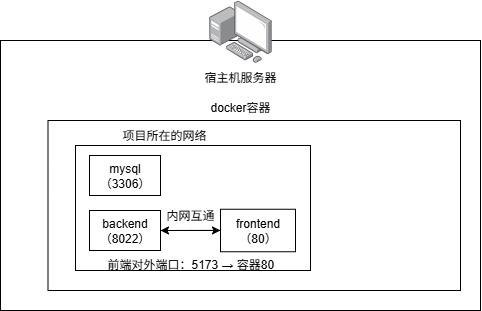
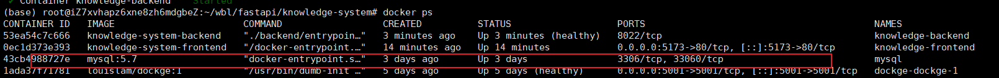

# 服务器部署

## 阿里云服务器docker配置镜像加速

- 创建/etc/docker目录

```bash
mkdir -p /etc/docker
```

- 写入镜像地址

```bash
tee /etc/docker/daemon.json <<-'EOF'
{
  "registry-mirrors": [
    "https://docker.m.daocloud.io"
  ]
}
EOF
```

- 重启docker

```bash
systemctl daemon-reload && systemctl restart docker
```

## 阿里云服务器为docker配置本地代理

- 创建/etc/systemd/system/docker.service.d文件

```bash
mkdir -p /etc/systemd/system/docker.service.d
```

- 查看文件内容并且写入

```bash
cat > /etc/systemd/system/docker.service.d/proxy.conf << 'EOF'
[Service]
Environment="HTTP_PROXY=http://127.0.0.1:7890"
Environment="HTTPS_PROXY=http://127.0.0.1:7890"
EOF
```

- 重启docker

```bash
systemctl daemon-reload && systemctl restart docker
```

- 验证代理是否生效

```bash
systemctl show --property=Environment docker # 出现这个表示成功Environment=HTTP_PROXY=http://127.0.0.1:7890 HTTPS_PROXY=http://127.0.0.1:7890
```

## Docker部署网络图（以知识库项目为例）



## Docker使用

### 数据库使用



```bash
# 进入数据库（mysql为docker创建的mysql名称，建议不要像我这样同名）
docker exec -it mysql mysql -uroot -proot123456
```

docker中的数据库可以看到与宿主机的mysql是隔离的，当前没有映射宿主机端口。

### Dockerfile文件使用

- docker-compose.yml（没有创建数据库）

```yaml
services:
  backend:
    build:
      context: .
      dockerfile: backend/Dockerfile
    container_name: knowledge-backend
    restart: unless-stopped
    env_file:
      - ./backend/.env
    environment:
      DB_HOST: mysql
      DB_PORT: 3306
      DB_USER: knowledge_user
      DB_PASSWORD: Knowledge@123
      DB_NAME: knowledge_system
    volumes:
      - ./backend/uploads:/app/backend/uploads
      - ./logs:/app/logs
    networks:
      - knowledge-net
    healthcheck:
      test: ["CMD", "python", "-c", "import urllib.request; urllib.request.urlopen('http://localhost:8022/health')"]
      interval: 30s
      timeout: 10s
      retries: 5
      start_period: 60s

  frontend:
    build:
      context: ./frontend
      dockerfile: Dockerfile
    container_name: knowledge-frontend
    restart: unless-stopped
    ports:
     # 服务器端口5173 映射 到docker容器内端口80
      - "5173:80"
    volumes:
      # 挂载本地构建好的 dist 目录（本地构建后直接生效，无需重新构建镜像）
      - ./frontend/dist:/usr/share/nginx/html:ro
    depends_on:
      - backend
    networks:
      - knowledge-net

networks:
  knowledge-net:
    driver: bridge
    external: false

```

- backend/dockfile

```dockerfile
FROM python:3.11-slim

# 工作目录设为 /app，backend 代码放在 /app/backend/ 下，保持包路径 backend.main:app
WORKDIR /app

# 安装系统依赖
RUN apt-get update && apt-get install -y --no-install-recommends \
    gcc \
    default-libmysqlclient-dev \
    pkg-config \
    && rm -rf /var/lib/apt/lists/*

# 复制依赖文件并安装（build context 是项目根目录）
COPY backend/requirements-docker.txt .
RUN pip install --no-cache-dir -r requirements-docker.txt

# 复制 aerich 配置和迁移文件（需要在 /app 根目录，aerich 从这里读取）
COPY pyproject.toml ./pyproject.toml
COPY backend/migrations ./migrations

# 复制 backend 代码到 /app/backend/
COPY backend ./backend

# 修复 entrypoint.sh 换行符（CRLF -> LF）并设置可执行权限
RUN sed -i 's/\r$//' ./backend/entrypoint.sh && \
    chmod +x ./backend/entrypoint.sh

EXPOSE 8022

ENTRYPOINT ["./backend/entrypoint.sh"]
```

- frontend/dockerfile

```dockerfile
# 生产阶段 - 直接使用本地构建好的 dist 目录
FROM nginx:alpine

# 只复制 nginx.conf，dist 目录通过 docker-compose volumes 挂载
COPY nginx.conf /etc/nginx/conf.d/default.conf

EXPOSE 80
```

## 部署流程

- 代码仓库https://github.com/muioo/knowledge-system.git
- 数据库迁移脚本. /backend/entrypoint.sh

```bash
#!/bin/sh
# 不使用 set -e，以便显示错误信息

echo "=== Waiting for MySQL to be ready ==="
MAX_RETRIES=30
RETRY=0
while true; do
    if python -c "
import asyncio, sys
from tortoise import Tortoise
from backend.settings.config import TORTOISE_ORM
async def check():
    try:
        await Tortoise.init(config=TORTOISE_ORM)
        await Tortoise.close_connections()
        print('OK')
    except Exception as e:
        print(f'ERROR: {e}', file=sys.stderr)
        sys.exit(1)
asyncio.run(check())
" 2>&1; then
        break
    fi

    RETRY=$((RETRY + 1))
    if [ $RETRY -ge $MAX_RETRIES ]; then
        echo "MySQL not ready after ${MAX_RETRIES} retries, exiting."
        exit 1
    fi
    echo "  MySQL not ready yet, retrying in 2s... ($RETRY/$MAX_RETRIES)"
    sleep 2
done
echo "MySQL is ready."

echo "=== Running aerich migrations ==="
# 使用 aerich CLI 但先读取迁移文件，分割后逐条执行
python << 'PYTHON_SCRIPT'
import asyncio
import sys
import traceback
import os
import re
from pathlib import Path

async def init_db_with_tortoise():
    """使用 TortoiseORM 直接初始化数据库表（无 migrations 时）"""
    from tortoise import Tortoise
    from backend.settings.config import TORTOISE_ORM

    print("No migrations directory found, using TortoiseORM to initialize database...")
    await Tortoise.init(config=TORTOISE_ORM)
    await Tortoise.generate_schemas()
    print(f"Database tables created successfully!")
    await Tortoise.close_connections()

async def migrate():
    try:
        from aerich import Command
        from aerich.models import Aerich
        from backend.settings.config import TORTOISE_ORM
        from tortoise import Tortoise, connections

        print("Initializing aerich...")
        # 初始化 Tortoise 和 aerich
        await Tortoise.init(config=TORTOISE_ORM)
        command = Command(tortoise_config=TORTOISE_ORM, location='migrations')
        await command.init()

        print("Checking for pending migrations...")
        # 检查是否有待执行的迁移
        migrations_path = Path('migrations/models')
        if not migrations_path.exists():
            print('No migrations directory found')
            # 使用 TortoiseORM 直接初始化数据库表
            await init_db_with_tortoise()
            return

        # 获取所有迁移文件
        migration_files = sorted(migrations_path.glob('*.py'))
        if not migration_files:
            print('No migration files found')
            # 使用 TortoiseORM 直接初始化数据库表
            await init_db_with_tortoise()
            return

        # 获取已应用的迁移
        applied_versions = []
        try:
            applied = await Aerich.all().values('version')
            applied_versions = [a['version'] for a in applied]
            print(f"Already applied migrations: {applied_versions}")
        except Exception as e:
            print(f"No aerich table yet (first run): {e}")
            pass  # 首次运行，aerich 表还不存在

        # 找出待执行的迁移
        pending = []
        for f in migration_files:
            if f.name.startswith('0_'):
                # 初始迁移特殊处理
                if not applied_versions:
                    pending.append(f)
            else:
                # 检查完整文件名是否在已应用列表中
                if f.name not in applied_versions:
                    pending.append(f)

        if not pending:
            print('No new migrations to run')
            await Tortoise.close_connections()
            return

        print(f"Found {len(pending)} pending migrations: {[f.name for f in pending]}")

        # 逐个执行迁移
        for i, migration_file in enumerate(pending, 1):
            print(f"  [{i}/{len(pending)}] Applying {migration_file.name}...")

            # 动态导入迁移模块
            module_name = f"migrations.models.{migration_file.stem}"
            module = __import__(module_name, fromlist=['upgrade'])

            # 获取升级 SQL
            conn = connections.get('default')
            upgrade_sql = await module.upgrade(conn)

            # 分割 SQL 语句
            # 简单方法：按分号分割，然后过滤空语句
            statements = []

            # 移除多行注释 /* ... */
            import re
            upgrade_sql = re.sub(r'/\*.*?\*/', '', upgrade_sql, flags=re.DOTALL)

            # 移除单行注释 --
            upgrade_sql = re.sub(r'--.*?$', '', upgrade_sql, flags=re.MULTILINE)

            # 按分号分割并清理
            raw_statements = upgrade_sql.split(';')
            for stmt in raw_statements:
                # 移除前后空白和空行
                cleaned = '\n'.join(line.strip() for line in stmt.split('\n') if line.strip())
                if cleaned:
                    statements.append(cleaned)

            print(f"    Found {len(statements)} SQL statements to execute")

            # 逐条执行 SQL
            for j, stmt in enumerate(statements, 1):
                try:
                    # 清理语句
                    stmt_clean = stmt.strip().rstrip(';')
                    if not stmt_clean:
                        continue

                    await conn.execute_script(stmt_clean)
                    print(f"    [{j}/{len(statements)}] Executed successfully")
                except Exception as e:
                    error_str = str(e)
                    # 跳过已存在的错误
                    if 'already exists' in error_str or 'Duplicate column' in error_str or 'Duplicate key' in error_str:
                        print(f"    [{j}/{len(statements)}] Skipped (already exists)")
                        continue
                    print(f"    [{j}/{len(statements)}] ERROR: {e}")
                    print(f"    SQL: {stmt_clean[:200]}...")
                    # 不抛出异常，继续执行下一条语句

            # 记录迁移
            try:
                # 使用完整文件名作为版本
                version = migration_file.name
                await Aerich.create(
                    version=version,
                    app='models',
                    content=upgrade_sql
                )
                print(f"  [{i}/{len(pending)}] Recorded migration: {migration_file.name}")
            except Exception as e:
                if 'Duplicate entry' in str(e):
                    print(f"  [{i}/{len(pending)}] Migration already recorded")
                else:
                    raise

        print('All migrations completed successfully')

    except Exception as e:
        print(f"Migration error: {e}")
        traceback.print_exc()
        sys.exit(1)

asyncio.run(migrate())
PYTHON_SCRIPT

echo "=== Migrations complete, starting server ==="
exec uvicorn backend.main:app --host 0.0.0.0 --port 8022
```

- 数据库连接脚本./init-db.sh

```bash
#!/bin/bash
# 在服务器上运行此脚本初始化数据库

echo "=== 初始化 MySQL 数据库 ==="

# 连接到 MySQL 容器并创建数据库和用户(docker创建的mysql容器名)
docker exec -i mysql mysql -uroot -proot123456 <<EOF
-- 创建数据库
CREATE DATABASE IF NOT EXISTS knowledge_system CHARACTER SET utf8mb4 COLLATE utf8mb4_unicode_ci;

-- 创建用户（如果不存在）
CREATE USER IF NOT EXISTS 'knowledge_user'@'%' IDENTIFIED BY 'Knowledge@123';

-- 授予权限
GRANT ALL PRIVILEGES ON knowledge_system.* TO 'knowledge_user'@'%';
FLUSH PRIVILEGES;

-- 显示结果
SHOW DATABASES;
SELECT User, Host FROM mysql.user WHERE User='knowledge_user';
EOF

echo "=== 数据库初始化完成 ==="

```

- 拉取代码

```bash
git clone -b production https://github.com/muioo/knowledge-system.git
```

- 配置.env文件

```bash
# 应用配置
SECRET_KEY=...
DEBUG=false

# 数据库配置（连接已有的 MySQL 容器）
DB_HOST=mysql
DB_PORT=3306
DB_USER=knowledge_user
DB_PASSWORD=Knowledge@123
DB_NAME=knowledge_system

# CORS 配置（填写你的服务器 IP 和前端端口）
CORS_ORIGINS=["ip:port"]

# 火山引擎 AI 配置
ARK_API_KEY=

# 前端端口（docker-compose 使用）
FRONTEND_PORT=5173
```

- 构建项目

```bash
docker compose -d build
```

- 后续更新代码

```bash
git pull origin production
docker compose up -d --build backend # 构建镜像 启动容器
docker compose up -d frontend # 启动容器 docker-compose.yml中的frontend
docker compose up -d backend
```


