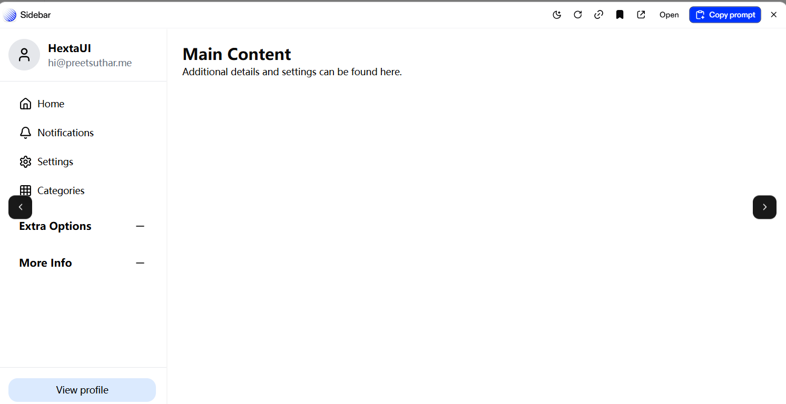
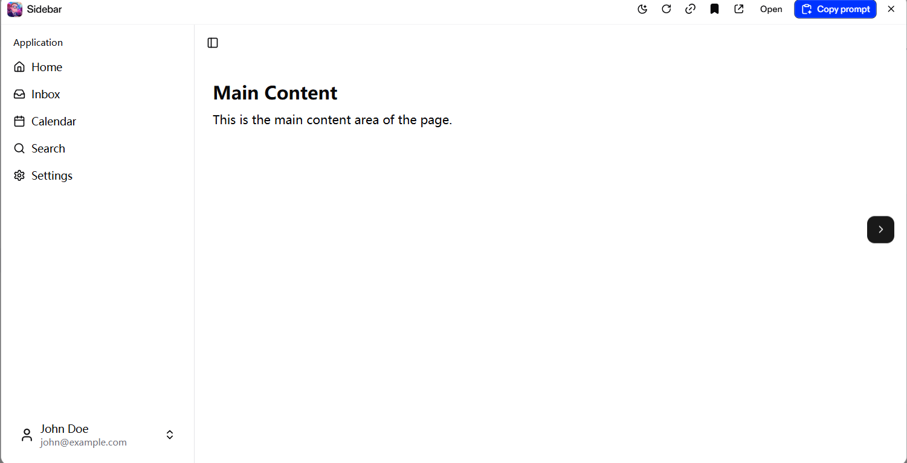

# 前端样式提示词

## 一、表格样式

````markdown
You are given a task to integrate an existing React component in the codebase

The codebase should support:
- shadcn project structure  
- Tailwind CSS
- Typescript

If it doesn't, provide instructions on how to setup project via shadcn CLI, install Tailwind or Typescript.

Determine the default path for components and styles. 
If default path for components is not /components/ui, provide instructions on why it's important to create this folder
Copy-paste this component to /components/ui folder:
```tsx
table.tsx
import React from "react";

export const Table = ({ children }: { children: React.ReactNode }) => {
  return (
    <div className="w-full overflow-auto min-w-[248px] p-6 rounded-lg relative border border-gray-alpha-400 bg-background-100">
      <table className="w-full border-collapse text-sm font-sans text-gray-900">
        {children}
      </table>
    </div>
  );
};

Table.Colgroup = ({ children }: { children: React.ReactNode }) => {
  return <colgroup>{children}</colgroup>;
};

Table.Col = ({ className }: { className?: string }) => {
  return <col className={className} />;
};

Table.Header = ({ children }: { children: React.ReactNode }) => {
  return <thead className="border-b border-gray-alpha-400">{children}</thead>;
};

Table.Body = ({ children, striped, interactive, virtualize }: {
  children: React.ReactNode,
  striped?: boolean,
  interactive?: boolean,
  virtualize?: boolean
}) => {
  return (
    <>
      <tbody className="table-row h-3" />
      <tbody className={`${striped ? "[&_tr:where(:nth-child(odd))]:bg-background-200" : ""}${interactive ? " [&_tr:hover]:bg-gray-100" : ""}`}>
        {children}
      </tbody>
    </>
  );
};

Table.Row = ({ children }: { children: React.ReactNode }) => {
  return <tr className="[&_td:first-child]:rounded-l-[4px] [&_td:last-child]:rounded-r-[4px] transition-colors">{children}</tr>;
};

Table.Head = ({ children }: { children: React.ReactNode }) => {
  return <th className="h-10 px-2 align-middle font-medium text-left last:text-right">{children}</th>;
};

Table.Cell = ({ children, className, colSpan }: { children: React.ReactNode, className?: string, colSpan?: number }) => {
  return <td className={`px-2 py-2.5 align-middle last:text-right ${className || ""}`} colSpan={colSpan}>{children}</td>;
};

Table.Footer = ({ children }: { children: React.ReactNode }) => {
  return <tfoot className="border-t border-gray-alpha-400">{children}</tfoot>;
};


demo.tsx
import React, { memo, useState } from "react";
import { Table } from "@/components/ui/table";
import { ShowMore } from "@/components/ui/show-more";

const formatter = new Intl.NumberFormat("en-US", {
  style: "currency",
  maximumFractionDigits: 2,
  currency: "usd",
});

const formatCurrency = (amount: number): string => {
  return formatter.format(amount);
};

const items = [
  {
    product: "Brake Pads Set",
    usage: "100 sets",
    price: "$50 per set",
    charge: 5000,
  },
  {
    product: "Oil Filters",
    usage: "200 filters",
    price: "$10 per filter",
    charge: 2000,
  },
  {
    product: "Car Batteries",
    usage: "50 batteries",
    price: "$100 per battery",
    charge: 5000,
  },
  {
    product: "Headlight Bulbs",
    usage: "300 bulbs",
    price: "$15 per bulb",
    charge: 4500,
  },
  {
    product: "Windshield Wipers",
    usage: "250 pairs",
    price: "$20 per pair",
    charge: 5000,
  },
  {
    product: "Spark Plugs",
    usage: "500 sets",
    price: "$5 per set",
    charge: 2500,
  },
];

const Row = memo(function Row({ item }: { item: (typeof items)[number] }) {
  return (
    <Table.Row>
      <Table.Cell>{item.product}</Table.Cell>
      <Table.Cell>{item.usage}</Table.Cell>
      <Table.Cell>{item.price}</Table.Cell>
      <Table.Cell>{formatCurrency(item.charge)}</Table.Cell>
    </Table.Row>
  );
});

export const BasicTable = () => (
  <div className="w-full flex flex-col justify-center">
    <div className="font-bold text-xl dark:text-white">Basic table</div>
    <div className="w-full mt-[8px]">
      <Table>
        <Table.Header>
          <Table.Row>
            <Table.Head>Col 1</Table.Head>
            <Table.Head>Col 2</Table.Head>
            <Table.Head>Col 3</Table.Head>
          </Table.Row>
        </Table.Header>
        <Table.Body>
          <Table.Row>
            <Table.Cell>Value 1.1</Table.Cell>
            <Table.Cell>Value 1.2</Table.Cell>
            <Table.Cell>Value 1.3</Table.Cell>
          </Table.Row>
          <Table.Row>
            <Table.Cell>Value 2.1</Table.Cell>
            <Table.Cell>Value 2.2</Table.Cell>
            <Table.Cell>Value 2.3</Table.Cell>
          </Table.Row>
          <Table.Row>
            <Table.Cell>Value 3.1</Table.Cell>
            <Table.Cell>Value 3.2</Table.Cell>
            <Table.Cell>Value 3.3</Table.Cell>
          </Table.Row>
        </Table.Body>
      </Table>
    </div>
  </div>
);

export const StripedTable = () => (
  <div className="w-full flex flex-col justify-center">
    <div className="font-bold text-xl dark:text-white">Striped table</div>
    <div className="w-full mt-[8px]">
      <Table>
        <Table.Header>
          <Table.Row>
            <Table.Head>Col 1</Table.Head>
            <Table.Head>Col 2</Table.Head>
            <Table.Head>Col 3</Table.Head>
          </Table.Row>
        </Table.Header>
        <Table.Body striped>
          <Table.Row>
            <Table.Cell>Value 1.1</Table.Cell>
            <Table.Cell>Value 1.2</Table.Cell>
            <Table.Cell>Value 1.3</Table.Cell>
          </Table.Row>
          <Table.Row>
            <Table.Cell>Value 2.1</Table.Cell>
            <Table.Cell>Value 2.2</Table.Cell>
            <Table.Cell>Value 2.3</Table.Cell>
          </Table.Row>
          <Table.Row>
            <Table.Cell>Value 3.1</Table.Cell>
            <Table.Cell>Value 3.2</Table.Cell>
            <Table.Cell>Value 3.3</Table.Cell>
          </Table.Row>
        </Table.Body>
      </Table>
    </div>
  </div>
);

export const InteractiveTable = () => (
  <div className="w-full flex flex-col justify-center">
    <div className="font-bold text-xl dark:text-white">Interactive table</div>
    <div className="w-full mt-[8px]">
      <Table>
        <Table.Header>
          <Table.Row>
            <Table.Head>Col 1</Table.Head>
            <Table.Head>Col 2</Table.Head>
            <Table.Head>Col 3</Table.Head>
          </Table.Row>
        </Table.Header>
        <Table.Body interactive>
          <Table.Row>
            <Table.Cell>Value 1.1</Table.Cell>
            <Table.Cell>Value 1.2</Table.Cell>
            <Table.Cell>Value 1.3</Table.Cell>
          </Table.Row>
          <Table.Row>
            <Table.Cell>Value 2.1</Table.Cell>
            <Table.Cell>Value 2.2</Table.Cell>
            <Table.Cell>Value 2.3</Table.Cell>
          </Table.Row>
          <Table.Row>
            <Table.Cell>Value 3.1</Table.Cell>
            <Table.Cell>Value 3.2</Table.Cell>
            <Table.Cell>Value 3.3</Table.Cell>
          </Table.Row>
        </Table.Body>
      </Table>
    </div>
  </div>
);

export const FullFeaturedTable = () => (
  <div className="w-full flex flex-col justify-center">
    <div className="font-bold text-xl dark:text-white">Full featured table</div>
    <div className="w-full mt-[8px]">
      <Table>
        <Table.Colgroup>
          <Table.Col className="w-[44%]" />
          <Table.Col className="w-[22%]" />
          <Table.Col className="w-[22%]" />
          <Table.Col className="w-[11%]" />
        </Table.Colgroup>
        <Table.Header>
          <Table.Row>
            <Table.Head>Product</Table.Head>
            <Table.Head>Usage</Table.Head>
            <Table.Head>Price</Table.Head>
            <Table.Head>Charge</Table.Head>
          </Table.Row>
        </Table.Header>
        <Table.Body interactive striped>
          {items.map((item) => (
            <Table.Row key={item.product}>
              <Table.Cell>{item.product}</Table.Cell>
              <Table.Cell>{item.usage}</Table.Cell>
              <Table.Cell>{item.price}</Table.Cell>
              <Table.Cell>{formatCurrency(item.charge)}</Table.Cell>
            </Table.Row>
          ))}
        </Table.Body>
        <Table.Footer>
          <Table.Row>
            <Table.Cell
              className="text-[#171717] dark:text-[#ededed] font-medium"
              colSpan={3}
            >
              Subtotal
            </Table.Cell>
            <Table.Cell className="text-[#171717] dark:text-[#ededed] font-medium">
              {formatCurrency(items.reduce((sum, val) => sum + val.charge, 0))}
            </Table.Cell>
          </Table.Row>
        </Table.Footer>
      </Table>
    </div>
  </div>
);

export const VirtualizedTable = () => {
  const [expanded, setExpanded] = useState(false);

  return (
    <div className="w-full flex flex-col justify-center">
      <div className="font-bold text-xl dark:text-white">Virtualized table</div>
      <div className="w-full mt-[8px] relative">
        <Table>
          <Table.Colgroup>
            <Table.Col className="w-[44%]" />
            <Table.Col className="w-[22%]" />
            <Table.Col className="w-[22%]" />
            <Table.Col className="w-[11%]" />
          </Table.Colgroup>
          <Table.Header>
            <Table.Row>
              <Table.Head>Product</Table.Head>
              <Table.Head>Usage</Table.Head>
              <Table.Head>Price</Table.Head>
              <Table.Head>Charge</Table.Head>
            </Table.Row>
          </Table.Header>
          <Table.Body interactive striped virtualize>
            {new Array(5_000).fill(null).map((_, index) => {
              if (!expanded && index >= 9) return null;
              const item = items[index % items.length];
              if (!item) return null;
              return <Row item={item} key={`${item.product}${index}`} />;
            })}
          </Table.Body>
        </Table>
        {expanded ? null : (
          <div className="pointer-events-none absolute bottom-0 left-0 h-[30%] w-full rounded bg-gradient-to-t from-white dark:from-[#0a0a0a] to-transparent opacity-80" />
        )}
        <div className={expanded ? "h-16" : "h-4"} />
        <div className="pointer-events-none absolute bottom-0 left-0 flex h-[calc(100%-160px)] w-full flex-col justify-end">
          <ShowMore
            className="pointer-events-auto sticky bottom-4 mb-4"
            expanded={expanded}
            noBorder
            onClick={() => setExpanded((x) => !x)}
          />
        </div>
      </div>
    </div>
  );
};

```

Copy-paste these files for dependencies:
```tsx
shugar/show-more
import React from "react";

interface ShowMoreProps {
  expanded: boolean;
  onClick: React.Dispatch<React.SetStateAction<boolean>>;
  noBorder?: boolean;
  className?: string;
}

export const ShowMore = ({ expanded = false, onClick, className = "" }: ShowMoreProps) => {
  return (
    <div className={`w-[calc(100%_-_40px)] flex items-center justify-center min-h-[30px] ${className}`}>
      <div className="rounded-[99px] bg-background">
        <button
          type="submit"
          className="h-8 px-3 text-sm rounded-[100px] text-gray-1000 font-sans bg-background-100 font-medium border border-gray-alpha-400 duration-150"
          onClick={() => onClick(!expanded)}
        >
          <span className="text-nowrap inline-block">
            <div className="flex items-center">
              Show {expanded ? "Less" : "More"}
              <span className={`inline-flex ml-1 duration-200${expanded ? " rotate-180" : ""}`}>
                <svg
                  height="16"
                  strokeLinejoin="round"
                  viewBox="0 0 16 16"
                  width="16"
                  className="fill-gray-1000"
                >
                  <path
                    fillRule="evenodd"
                    clipRule="evenodd"
                    d="M12.0607 6.74999L11.5303 7.28032L8.7071 10.1035C8.31657 10.4941 7.68341 10.4941 7.29288 10.1035L4.46966 7.28032L3.93933 6.74999L4.99999 5.68933L5.53032 6.21966L7.99999 8.68933L10.4697 6.21966L11 5.68933L12.0607 6.74999Z"
                  />
                </svg>
              </span>
            </div>
          </span>
        </button>
      </div>
    </div>
  );
};
```
```tsx
shugar/snippet
import React, { useRef, useState } from "react";

type TSnippetType = "success" | "warning" | "error";

interface SnippetProps {
  text: string | string[];
  width?: string;
  onCopy?: () => void;
  prompt?: boolean;
  dark?: boolean;
  type?: TSnippetType;
}

const variant = {
  default: {
    background: "bg-background-100",
    text: "text-gray-1000",
    fill: "fill-gray-1000"
  },
  inverted: {
    background: "bg-gray-1000",
    text: "text-gray-100",
    fill: "fill-gray-100"
  },
  success: {
    background: "bg-blue-100",
    text: "text-blue-900",
    fill: "fill-blue-900"
  },
  warning: {
    background: "bg-amber-100",
    text: "text-amber-900",
    fill: "fill-amber-900"
  },
  error: {
    background: "bg-red-100",
    text: "text-red-900",
    fill: "fill-red-900"
  }
};

const getVariant = (inverted: boolean, type: TSnippetType | undefined) => {
  if (inverted) {
    return variant.inverted;
  }
  switch (type) {
    case "success":
      return variant.success;
    case "warning":
      return variant.warning;
    case "error":
      return variant.error;
    default:
      return variant.default;
  }
};

export const Snippet = ({
  text,
  width = "100%",
  onCopy,
  prompt = true,
  dark = false,
  type
}: SnippetProps) => {
  const [animation, setAnimation] = useState<boolean>(false);
  const animationTimeout = useRef<NodeJS.Timeout>(null);
  const _text = typeof text === "string" ? [text] : text;
  const colors = getVariant(dark, type);

  const onClick = () => {
    if (animationTimeout.current) {
      clearTimeout(animationTimeout.current);
    }
    setAnimation(true);
    animationTimeout.current = setTimeout(() => setAnimation(false), 2000);

    navigator.clipboard.writeText(_text.reduce((prev, curr) => prev + "
" + curr));

    if (onCopy) {
      onCopy();
    }
  };

  return (
    <div
      className={`flex px-3 py-2.5 rounded-md border border-gray-alpha-400 ${colors.background}`}
      style={{ width: width }}
    >
      <div className="mr-3">
        {_text.map((item) => (
          <div key={item} className={`font-mono text-[13px] ${prompt ? "before:content-['$_']" : ""} ${colors.text}`}>
            {item}
          </div>
        ))}
      </div>
      <div className={`ml-auto cursor-pointer relative`}>
        <svg
          height="16"
          strokeLinejoin="round"
          viewBox="0 0 16 16"
          width="16"
          className={`absolute ${_text.length > 1 ? "top-0" : "top-1/2 -translate-y-1/2"} right-0 z-10 ${colors.fill}${animation ? " animate-fade-out" : ""}`}
          onClick={onClick}
        >
          <path
            fillRule="evenodd"
            clipRule="evenodd"
            d="M2.75 0.5C1.7835 0.5 1 1.2835 1 2.25V9.75C1 10.7165 1.7835 11.5 2.75 11.5H3.75H4.5V10H3.75H2.75C2.61193 10 2.5 9.88807 2.5 9.75V2.25C2.5 2.11193 2.61193 2 2.75 2H8.25C8.38807 2 8.5 2.11193 8.5 2.25V3H10V2.25C10 1.2835 9.2165 0.5 8.25 0.5H2.75ZM7.75 4.5C6.7835 4.5 6 5.2835 6 6.25V13.75C6 14.7165 6.7835 15.5 7.75 15.5H13.25C14.2165 15.5 15 14.7165 15 13.75V6.25C15 5.2835 14.2165 4.5 13.25 4.5H7.75ZM7.5 6.25C7.5 6.11193 7.61193 6 7.75 6H13.25C13.3881 6 13.5 6.11193 13.5 6.25V13.75C13.5 13.8881 13.3881 14 13.25 14H7.75C7.61193 14 7.5 13.8881 7.5 13.75V6.25Z"
          />
        </svg>
        <svg
          height="16"
          strokeLinejoin="round"
          viewBox="0 0 16 16"
          width="16"
          className={`absolute top-0 right-0 ${colors.fill} opacity-0${animation ? " animate-fade-in" : ""}`}
        >
          <path
            fillRule="evenodd"
            clipRule="evenodd"
            d="M15.5607 3.99999L15.0303 4.53032L6.23744 13.3232C5.55403 14.0066 4.44599 14.0066 3.76257 13.3232L4.2929 12.7929L3.76257 13.3232L0.969676 10.5303L0.439346 9.99999L1.50001 8.93933L2.03034 9.46966L4.82323 12.2626C4.92086 12.3602 5.07915 12.3602 5.17678 12.2626L13.9697 3.46966L14.5 2.93933L15.5607 3.99999Z"
          />
        </svg>
      </div>
    </div>
  );
};
```

Extend existing tailwind.config.js with this code:
```js
/** @type {import("tailwindcss").Config} */

module.exports = {
  theme: {
    extend: {
      colors: {
        "gray-900": "var(--ds-gray-900)",
        "gray-alpha-400": "var(--ds-gray-alpha-400)",
        "background-100": "var(--ds-background-100)",
        "background-200": "var(--ds-background-200)",
      }
    }
  },
};

```

Extend existing globals.css with this code:
```css
@layer base {
    :root {
        --ds-gray-900: hsla(0, 0%, 40%, 1);
        --ds-gray-alpha-400: hsla(0, 0%, 0%, 0.08);
        --ds-background-100: hsla(0, 0%, 100%, 1);
        --ds-background-200: hsla(0, 0%, 98%, 1);
    }

    .dark {
        --ds-gray-900: hsla(0, 0%, 63%, 1);
        --ds-gray-alpha-400: hsla(0, 0%, 100%, 0.14);
        --ds-background-100: hsla(0, 0%, 4%, 1);
        --ds-background-200: hsla(0, 0%, 0%, 1);
    }
}
```

Implementation Guidelines
 1. Analyze the component structure and identify all required dependencies
 2. Review the component's argumens and state
 3. Identify any required context providers or hooks and install them
 4. Questions to Ask
 - What data/props will be passed to this component?
 - Are there any specific state management requirements?
 - Are there any required assets (images, icons, etc.)?
 - What is the expected responsive behavior?
 - What is the best place to use this component in the app?

Steps to integrate
 0. Copy paste all the code above in the correct directories
 1. Install external dependencies
 2. Fill image assets with Unsplash stock images you know exist
 3. Use lucide-react icons for svgs or logos if component requires them

````

## 二、登入提示词

````markdown
You are given a task to integrate an existing React component in the codebase

The codebase should support:
- shadcn project structure  
- Tailwind CSS
- Typescript

If it doesn't, provide instructions on how to setup project via shadcn CLI, install Tailwind or Typescript.

Determine the default path for components and styles. 
If default path for components is not /components/ui, provide instructions on why it's important to create this folder
Copy-paste this component to /components/ui folder:
```tsx
travel-connect-signin-1.tsx

import React, { useRef, useEffect, useState } from "react";
import { Eye, EyeOff, ArrowRight } from "lucide-react";
import { motion, AnimatePresence } from "framer-motion";

// Helper function to merge class names
const cn = (...classes: string[]) => {
  return classes.filter(Boolean).join(" ");
};

// Custom Button Component
interface ButtonProps extends React.ButtonHTMLAttributes<HTMLButtonElement> {
  children: React.ReactNode;
  variant?: "default" | "outline";
  className?: string;
}

const Button = ({ 
  children, 
  variant = "default", 
  className = "", 
  ...props 
}: ButtonProps) => {
  const baseStyles = "inline-flex items-center justify-center gap-2 whitespace-nowrap rounded-md text-sm font-medium transition-colors focus-visible:outline-none focus-visible:ring-2 focus-visible:ring-blue-500 focus-visible:ring-offset-2 disabled:pointer-events-none disabled:opacity-50";
  
  const variantStyles = {
    default: "bg-primary bg-gradient-to-r from-blue-500 to-indigo-600 text-white hover:from-blue-600 hover:to-indigo-700",
    outline: "border border-input bg-background hover:bg-accent hover:text-accent-foreground"
  };
  
  return (
    <button
      className={`${baseStyles} ${variantStyles[variant]} ${className}`}
      {...props}
    >
      {children}
    </button>
  );
};

// Custom Input Component
interface InputProps extends React.InputHTMLAttributes<HTMLInputElement> {
  className?: string;
}

const Input = ({ className = "", ...props }: InputProps) => {
  return (
    <input
      className={`flex h-10 w-full rounded-md border bg-background px-3 py-2 text-sm text-gray-800 ring-offset-background file:border-0 file:bg-transparent file:text-sm file:font-medium file:text-foreground placeholder:text-gray-400 focus-visible:outline-none focus-visible:ring-2 focus-visible:ring-blue-500 focus-visible:ring-offset-2 disabled:cursor-not-allowed disabled:opacity-50 ${className}`}
      {...props}
    />
  );
};

type RoutePoint = {
  x: number;
  y: number;
  delay: number;
};

const DotMap = () => {
  const canvasRef = useRef<HTMLCanvasElement>(null);
  const [dimensions, setDimensions] = useState({ width: 0, height: 0 });

  // Set up routes that will animate across the map
  const routes: { start: RoutePoint; end: RoutePoint; color: string }[] = [
    {
      start: { x: 100, y: 150, delay: 0 },
      end: { x: 200, y: 80, delay: 2 },
      color: "#2563eb", // Slightly darker blue for better visibility on light bg
    },
    {
      start: { x: 200, y: 80, delay: 2 },
      end: { x: 260, y: 120, delay: 4 },
      color: "#2563eb",
    },
    {
      start: { x: 50, y: 50, delay: 1 },
      end: { x: 150, y: 180, delay: 3 },
      color: "#2563eb",
    },
    {
      start: { x: 280, y: 60, delay: 0.5 },
      end: { x: 180, y: 180, delay: 2.5 },
      color: "#2563eb",
    },
  ];

  // Create dots for the world map
  const generateDots = (width: number, height: number) => {
    const dots = [];
    const gap = 12;
    const dotRadius = 1;

    // Create a dot grid pattern with random opacity
    for (let x = 0; x < width; x += gap) {
      for (let y = 0; y < height; y += gap) {
        // Shape the dots to form a world map silhouette
        const isInMapShape =
          // North America
          ((x < width * 0.25 && x > width * 0.05) && (y < height * 0.4 && y > height * 0.1)) ||
          // South America
          ((x < width * 0.25 && x > width * 0.15) && (y < height * 0.8 && y > height * 0.4)) ||
          // Europe
          ((x < width * 0.45 && x > width * 0.3) && (y < height * 0.35 && y > height * 0.15)) ||
          // Africa
          ((x < width * 0.5 && x > width * 0.35) && (y < height * 0.65 && y > height * 0.35)) ||
          // Asia
          ((x < width * 0.7 && x > width * 0.45) && (y < height * 0.5 && y > height * 0.1)) ||
          // Australia
          ((x < width * 0.8 && x > width * 0.65) && (y < height * 0.8 && y > height * 0.6));

        if (isInMapShape && Math.random() > 0.3) {
          dots.push({
            x,
            y,
            radius: dotRadius,
            opacity: Math.random() * 0.5 + 0.2, // Slightly higher opacity for light theme
          });
        }
      }
    }
    return dots;
  };

  useEffect(() => {
    const canvas = canvasRef.current;
    if (!canvas) return;

    const resizeObserver = new ResizeObserver(entries => {
      const { width, height } = entries[0].contentRect;
      setDimensions({ width, height });
      canvas.width = width;
      canvas.height = height;
    });

    resizeObserver.observe(canvas.parentElement as Element);
    return () => resizeObserver.disconnect();
  }, []);

  useEffect(() => {
    if (!dimensions.width || !dimensions.height) return;

    const canvas = canvasRef.current;
    if (!canvas) return;

    const ctx = canvas.getContext("2d");
    if (!ctx) return;

    const dots = generateDots(dimensions.width, dimensions.height);
    let animationFrameId: number;
    let startTime = Date.now();

    // Draw background dots
    function drawDots() {
      ctx.clearRect(0, 0, dimensions.width, dimensions.height);
      
      // Draw the dots
      dots.forEach(dot => {
        ctx.beginPath();
        ctx.arc(dot.x, dot.y, dot.radius, 0, Math.PI * 2);
        ctx.fillStyle = `rgba(37, 99, 235, ${dot.opacity})`; // Blue dots for light theme
        ctx.fill();
      });
    }

    // Draw animated routes
    function drawRoutes() {
      const currentTime = (Date.now() - startTime) / 1000; // Time in seconds
      
      routes.forEach(route => {
        const elapsed = currentTime - route.start.delay;
        if (elapsed <= 0) return;
        
        const duration = 3; // Animation duration in seconds
        const progress = Math.min(elapsed / duration, 1);
        
        const x = route.start.x + (route.end.x - route.start.x) * progress;
        const y = route.start.y + (route.end.y - route.start.y) * progress;
        
        // Draw the route line
        ctx.beginPath();
        ctx.moveTo(route.start.x, route.start.y);
        ctx.lineTo(x, y);
        ctx.strokeStyle = route.color;
        ctx.lineWidth = 1.5;
        ctx.stroke();
        
        // Draw the start point
        ctx.beginPath();
        ctx.arc(route.start.x, route.start.y, 3, 0, Math.PI * 2);
        ctx.fillStyle = route.color;
        ctx.fill();
        
        // Draw the moving point
        ctx.beginPath();
        ctx.arc(x, y, 3, 0, Math.PI * 2);
        ctx.fillStyle = "#3b82f6";
        ctx.fill();
        
        // Add glow effect to the moving point
        ctx.beginPath();
        ctx.arc(x, y, 6, 0, Math.PI * 2);
        ctx.fillStyle = "rgba(59, 130, 246, 0.4)";
        ctx.fill();
        
        // If the route is complete, draw the end point
        if (progress === 1) {
          ctx.beginPath();
          ctx.arc(route.end.x, route.end.y, 3, 0, Math.PI * 2);
          ctx.fillStyle = route.color;
          ctx.fill();
        }
      });
    }
    
    // Animation loop
    function animate() {
      drawDots();
      drawRoutes();
      
      // If all routes are complete, restart the animation
      const currentTime = (Date.now() - startTime) / 1000;
      if (currentTime > 15) { // Reset after 15 seconds
        startTime = Date.now();
      }
      
      animationFrameId = requestAnimationFrame(animate);
    }
    
    animate();

    return () => cancelAnimationFrame(animationFrameId);
  }, [dimensions]);

  return (
    <div className="relative w-full h-full overflow-hidden">
      <canvas ref={canvasRef} className="absolute inset-0 w-full h-full" />
    </div>
  );
};

const SignInCard = () => {
  const [isPasswordVisible, setIsPasswordVisible] = useState(false);
  const [email, setEmail] = useState("");
  const [password, setPassword] = useState("");
  const [isHovered, setIsHovered] = useState(false);
  
  return (
    <div className="flex w-full h-full items-center justify-center">
      <motion.div
        initial={{ opacity: 0, scale: 0.95 }}
        animate={{ opacity: 1, scale: 1 }}
        transition={{ duration: 0.5 }}
        className="w-full max-w-4xl overflow-hidden rounded-2xl flex bg-white shadow-xl"
      >
        {/* Left side - Map */}
        <div className="hidden md:block w-1/2 h-[600px] relative overflow-hidden border-r border-gray-100">
          <div className="absolute inset-0 bg-gradient-to-br from-blue-50 to-indigo-100">
            <DotMap />
            
            {/* Logo and text overlay */}
            <div className="absolute inset-0 flex flex-col items-center justify-center p-8 z-10">
              <motion.div 
                initial={{ opacity: 0, y: -20 }}
                animate={{ opacity: 1, y: 0 }}
                transition={{ delay: 0.6, duration: 0.5 }}
                className="mb-6"
              >
                <div className="h-12 w-12 rounded-full bg-gradient-to-br from-blue-500 to-indigo-600 flex items-center justify-center shadow-lg shadow-blue-200">
                  <ArrowRight className="text-white h-6 w-6" />
                </div>
              </motion.div>
              <motion.h2 
                initial={{ opacity: 0, y: -20 }}
                animate={{ opacity: 1, y: 0 }}
                transition={{ delay: 0.7, duration: 0.5 }}
                className="text-3xl font-bold mb-2 text-center text-transparent bg-clip-text bg-gradient-to-r from-blue-600 to-indigo-600"
              >
                Travel Connect
              </motion.h2>
              <motion.p 
                initial={{ opacity: 0, y: -20 }}
                animate={{ opacity: 1, y: 0 }}
                transition={{ delay: 0.8, duration: 0.5 }}
                className="text-sm text-center text-gray-600 max-w-xs"
              >
                Sign in to access your global travel dashboard and connect with nomads worldwide
              </motion.p>
            </div>
          </div>
        </div>
        
        {/* Right side - Sign In Form */}
        <div className="w-full md:w-1/2 p-8 md:p-10 flex flex-col justify-center bg-white">
          <motion.div
            initial={{ opacity: 0, y: 20 }}
            animate={{ opacity: 1, y: 0 }}
            transition={{ duration: 0.5 }}
          >
            <h1 className="text-2xl md:text-3xl font-bold mb-1 text-gray-800">Welcome back</h1>
            <p className="text-gray-500 mb-8">Sign in to your account</p>
            
            <div className="mb-6">
              <button 
                className="w-full flex items-center justify-center gap-2 bg-gray-50 border border-gray-200 rounded-lg p-3 hover:bg-gray-100 transition-all duration-300 text-gray-700 shadow-sm"
                onClick={() => console.log("Google sign-in")}
              >
                <svg className="h-5 w-5" viewBox="0 0 24 24">
                  <path
                    fill="currentColor"
                    d="M22.56 12.25c0-.78-.07-1.53-.2-2.25H12v4.26h5.92c-.26 1.37-1.04 2.53-2.21 3.31v2.77h3.57c2.08-1.92 3.28-4.74 3.28-8.09z"
                    fillOpacity=".54"
                  />
                  <path
                    fill="#4285F4"
                    d="M12 23c2.97 0 5.46-.98 7.28-2.66l-3.57-2.77c-.98.66-2.23 1.06-3.71 1.06-2.86 0-5.29-1.93-6.16-4.53H2.18v2.84C3.99 20.53 7.7 23 12 23z"
                  />
                  <path
                    fill="#34A853"
                    d="M5.84 14.09c-.22-.66-.35-1.36-.35-2.09s.13-1.43.35-2.09V7.07H2.18C1.43 8.55 1 10.22 1 12s.43 3.45 1.18 4.93l2.85-2.22.81-.62z"
                  />
                  <path
                    fill="#FBBC05"
                    d="M12 5.38c1.62 0 3.06.56 4.21 1.64l3.15-3.15C17.45 2.09 14.97 1 12 1 7.7 1 3.99 3.47 2.18 7.07l3.66 2.84c.87-2.6 3.3-4.53 6.16-4.53z"
                  />
                  <path fill="#EA4335" d="M1 1h22v22H1z" fillOpacity="0" />
                </svg>
                <span>Login with Google</span>
              </button>
            </div>
            
            <div className="relative my-6">
              <div className="absolute inset-0 flex items-center">
                <div className="w-full border-t border-gray-200"></div>
              </div>
              <div className="relative flex justify-center text-sm">
                <span className="px-2 bg-white text-gray-500">or</span>
              </div>
            </div>
            
            <form className="space-y-5">
              <div>
                <label htmlFor="email" className="block text-sm font-medium text-gray-700 mb-1">
                  Email <span className="text-blue-500">*</span>
                </label>
                <Input
                  id="email"
                  type="email"
                  value={email}
                  onChange={(e) => setEmail(e.target.value)}
                  placeholder="Enter your email address"
                  required
                  className="bg-gray-50 border-gray-200 placeholder:text-gray-400 text-gray-800 w-full focus:border-blue-500 focus:ring-blue-500"
                />
              </div>
              
              <div>
                <label htmlFor="password" className="block text-sm font-medium text-gray-700 mb-1">
                  Password <span className="text-blue-500">*</span>
                </label>
                <div className="relative">
                  <Input
                    id="password"
                    type={isPasswordVisible ? "text" : "password"}
                    value={password}
                    onChange={(e) => setPassword(e.target.value)}
                    placeholder="Enter your password"
                    required
                    className="bg-gray-50 border-gray-200 placeholder:text-gray-400 text-gray-800 w-full pr-10 focus:border-blue-500 focus:ring-blue-500"
                  />
                  <button
                    type="button"
                    className="absolute inset-y-0 right-0 flex items-center pr-3 text-gray-500 hover:text-gray-700"
                    onClick={() => setIsPasswordVisible(!isPasswordVisible)}
                  >
                    {isPasswordVisible ? <EyeOff size={18} /> : <Eye size={18} />}
                  </button>
                </div>
              </div>
              
              <motion.div 
                whileHover={{ scale: 1.01 }}
                whileTap={{ scale: 0.98 }}
                onHoverStart={() => setIsHovered(true)}
                onHoverEnd={() => setIsHovered(false)}
                className="pt-2"
              >
                <Button
                  type="submit"
                  className={cn(
                    "w-full bg-gradient-to-r relative overflow-hidden from-blue-500 to-indigo-600 hover:from-blue-600 hover:to-indigo-700 text-white py-2 rounded-lg transition-all duration-300",
                    isHovered ? "shadow-lg shadow-blue-200" : ""
                  )}
                  onClick={(e) => {
                    e.preventDefault();
                    console.log("Sign in attempt with:", { email, password });
                  }}
                >
                  <span className="flex items-center justify-center">
                    Sign in
                    <ArrowRight className="ml-2 h-4 w-4" />
                  </span>
                  {isHovered && (
                    <motion.span
                      initial={{ left: "-100%" }}
                      animate={{ left: "100%" }}
                      transition={{ duration: 1, ease: "easeInOut" }}
                      className="absolute top-0 bottom-0 left-0 w-20 bg-gradient-to-r from-transparent via-white/30 to-transparent"
                      style={{ filter: "blur(8px)" }}
                    />
                  )}
                </Button>
              </motion.div>
              
              <div className="text-center mt-6">
                <a href="#" className="text-blue-600 hover:text-blue-700 text-sm transition-colors">
                  Forgot password?
                </a>
              </div>
            </form>
          </motion.div>
        </div>
      </motion.div>
    </div>
  );
};

const Index = () => {
  return (
    <div className="min-h-screen w-full flex items-center justify-center bg-gradient-to-br from-blue-50 to-indigo-100 p-4">
      <SignInCard />
    </div>
  );
};

export default Index;


demo.tsx
import * as React from "react"
import  Index from "@/components/ui/travel-connect-signin-1"


function DemoAiAssistatBasic() {
  return (
      <Index/>
  )
}

export { DemoAiAssistatBasic }

```

Install NPM dependencies:
```bash
lucide-react, framer-motion
```

Extend existing tailwind.config.js with this code:
```js
import type { Config } from "tailwindcss";

export default {
	darkMode: ["class"],
	content: [
		"./pages/**/*.{ts,tsx}",
		"./components/**/*.{ts,tsx}",
		"./app/**/*.{ts,tsx}",
		"./src/**/*.{ts,tsx}",
	],
	prefix: "",
	theme: {
		container: {
			center: true,
			padding: '2rem',
			screens: {
				'2xl': '1400px'
			}
		},
		extend: {
			colors: {
				border: 'hsl(var(--border))',
				input: 'hsl(var(--input))',
				ring: 'hsl(var(--ring))',
				background: 'hsl(var(--background))',
				foreground: 'hsl(var(--foreground))',
				primary: {
					DEFAULT: 'hsl(var(--primary))',
					foreground: 'hsl(var(--primary-foreground))'
				},
				secondary: {
					DEFAULT: 'hsl(var(--secondary))',
					foreground: 'hsl(var(--secondary-foreground))'
				},
				destructive: {
					DEFAULT: 'hsl(var(--destructive))',
					foreground: 'hsl(var(--destructive-foreground))'
				},
				muted: {
					DEFAULT: 'hsl(var(--muted))',
					foreground: 'hsl(var(--muted-foreground))'
				},
				accent: {
					DEFAULT: 'hsl(var(--accent))',
					foreground: 'hsl(var(--accent-foreground))'
				},
				popover: {
					DEFAULT: 'hsl(var(--popover))',
					foreground: 'hsl(var(--popover-foreground))'
				},
				card: {
					DEFAULT: 'hsl(var(--card))',
					foreground: 'hsl(var(--card-foreground))'
				},
				sidebar: {
					DEFAULT: 'hsl(var(--sidebar-background))',
					foreground: 'hsl(var(--sidebar-foreground))',
					primary: 'hsl(var(--sidebar-primary))',
					'primary-foreground': 'hsl(var(--sidebar-primary-foreground))',
					accent: 'hsl(var(--sidebar-accent))',
					'accent-foreground': 'hsl(var(--sidebar-accent-foreground))',
					border: 'hsl(var(--sidebar-border))',
					ring: 'hsl(var(--sidebar-ring))'
				}
			},
			borderRadius: {
				lg: 'var(--radius)',
				md: 'calc(var(--radius) - 2px)',
				sm: 'calc(var(--radius) - 4px)'
			},
			keyframes: {
				'accordion-down': {
					from: {
						height: '0'
					},
					to: {
						height: 'var(--radix-accordion-content-height)'
					}
				},
				'accordion-up': {
					from: {
						height: 'var(--radix-accordion-content-height)'
					},
					to: {
						height: '0'
					}
				}
			},
			animation: {
				'accordion-down': 'accordion-down 0.2s ease-out',
				'accordion-up': 'accordion-up 0.2s ease-out'
			}
		}
	},
	plugins: [require("tailwindcss-animate")],
} satisfies Config;

```

Extend existing globals.css with this code:
```css
@tailwind base;
@tailwind components;
@tailwind utilities;

@layer base {
  :root {
    --background: 0 0% 100%;
    --foreground: 222.2 84% 4.9%;

    --card: 0 0% 100%;
    --card-foreground: 222.2 84% 4.9%;

    --popover: 0 0% 100%;
    --popover-foreground: 222.2 84% 4.9%;

    --primary: 222.2 47.4% 11.2%;
    --primary-foreground: 210 40% 98%;

    --secondary: 210 40% 96.1%;
    --secondary-foreground: 222.2 47.4% 11.2%;

    --muted: 210 40% 96.1%;
    --muted-foreground: 215.4 16.3% 46.9%;

    --accent: 210 40% 96.1%;
    --accent-foreground: 222.2 47.4% 11.2%;

    --destructive: 0 84.2% 60.2%;
    --destructive-foreground: 210 40% 98%;

    --border: 214.3 31.8% 91.4%;
    --input: 214.3 31.8% 91.4%;
    --ring: 222.2 84% 4.9%;

    --radius: 0.5rem;

    --sidebar-background: 0 0% 98%;

    --sidebar-foreground: 240 5.3% 26.1%;

    --sidebar-primary: 240 5.9% 10%;

    --sidebar-primary-foreground: 0 0% 98%;

    --sidebar-accent: 240 4.8% 95.9%;

    --sidebar-accent-foreground: 240 5.9% 10%;

    --sidebar-border: 220 13% 91%;

    --sidebar-ring: 217.2 91.2% 59.8%;
  }

  .dark {
    --background: 222.2 84% 4.9%;
    --foreground: 210 40% 98%;

    --card: 222.2 84% 4.9%;
    --card-foreground: 210 40% 98%;

    --popover: 222.2 84% 4.9%;
    --popover-foreground: 210 40% 98%;

    --primary: 210 40% 98%;
    --primary-foreground: 222.2 47.4% 11.2%;

    --secondary: 217.2 32.6% 17.5%;
    --secondary-foreground: 210 40% 98%;

    --muted: 217.2 32.6% 17.5%;
    --muted-foreground: 215 20.2% 65.1%;

    --accent: 217.2 32.6% 17.5%;
    --accent-foreground: 210 40% 98%;

    --destructive: 0 62.8% 30.6%;
    --destructive-foreground: 210 40% 98%;

    --border: 217.2 32.6% 17.5%;
    --input: 217.2 32.6% 17.5%;
    --ring: 212.7 26.8% 83.9%;
    --sidebar-background: 240 5.9% 10%;
    --sidebar-foreground: 240 4.8% 95.9%;
    --sidebar-primary: 224.3 76.3% 48%;
    --sidebar-primary-foreground: 0 0% 100%;
    --sidebar-accent: 240 3.7% 15.9%;
    --sidebar-accent-foreground: 240 4.8% 95.9%;
    --sidebar-border: 240 3.7% 15.9%;
    --sidebar-ring: 217.2 91.2% 59.8%;
  }
}

@layer base {
  * {
    @apply border-border;
  }

  body {
    @apply bg-background text-foreground;
  }
}
```

Implementation Guidelines
 1. Analyze the component structure and identify all required dependencies
 2. Review the component's argumens and state
 3. Identify any required context providers or hooks and install them
 4. Questions to Ask
 - What data/props will be passed to this component?
 - Are there any specific state management requirements?
 - Are there any required assets (images, icons, etc.)?
 - What is the expected responsive behavior?
 - What is the best place to use this component in the app?

Steps to integrate
 0. Copy paste all the code above in the correct directories
 1. Install external dependencies
 2. Fill image assets with Unsplash stock images you know exist
 3. Use lucide-react icons for svgs or logos if component requires them

````

## 三、侧边栏样式

### 1、

````markdown
You are given a task to integrate an existing React component in the codebase

The codebase should support:
- shadcn project structure  
- Tailwind CSS
- Typescript

If it doesn't, provide instructions on how to setup project via shadcn CLI, install Tailwind or Typescript.

Determine the default path for components and styles. 
If default path for components is not /components/ui, provide instructions on why it's important to create this folder
Copy-paste this component to /components/ui folder:
```tsx
sidebar.tsx
"use client";

import { useState } from "react";
import { motion, AnimatePresence } from "framer-motion";
import { Home, User, Settings, Bell, Grid } from "lucide-react";

const AnimatedMenuToggle = ({
  toggle,
  isOpen,
}: {
  toggle: () => void;
  isOpen: boolean;
}) => (
  <button
    onClick={toggle}
    aria-label="Toggle menu"
    className="focus:outline-none z-999"
  >
    <motion.div animate={{ y: isOpen ? 13 : 0 }} transition={{ duration: 0.3 }}>
      <motion.svg
        width="20"
        height="20"
        viewBox="0 0 24 24"
        initial="closed"
        animate={isOpen ? "open" : "closed"}
        transition={{ duration: 0.3 }}
        className="text-black"
      >
        <motion.path
          fill="transparent"
          strokeWidth="3"
          stroke="currentColor"
          strokeLinecap="round"
          variants={{
            closed: { d: "M 2 2.5 L 22 2.5" },
            open: { d: "M 3 16.5 L 17 2.5" },
          }}
        />
        <motion.path
          fill="transparent"
          strokeWidth="3"
          stroke="currentColor"
          strokeLinecap="round"
          variants={{
            closed: { d: "M 2 12 L 22 12", opacity: 1 },
            open: { opacity: 0 },
          }}
          transition={{ duration: 0.2 }}
        />
        <motion.path
          fill="transparent"
          strokeWidth="3"
          stroke="currentColor"
          strokeLinecap="round"
          variants={{
            closed: { d: "M 2 21.5 L 22 21.5" },
            open: { d: "M 3 2.5 L 17 16.5" },
          }}
        />
      </motion.svg>
    </motion.div>
  </button>
);

const CollapsibleSection = ({
  title,
  children,
}: {
  title: string;
  children: React.ReactNode;
}) => {
  const [open, setOpen] = useState(false);

  return (
    <div className="mb-4">
      <button
        className="w-full flex items-center justify-between py-2 px-4 rounded-xl hover:bg-gray-100"
        onClick={() => setOpen(!open)}
      >
        <span className="font-semibold">{title}</span>
        {open ? <XIcon /> : <MenuIcon />}
      </button>
      <AnimatePresence>
        {open && (
          <motion.div
            initial={{ height: 0, opacity: 0 }}
            animate={{ height: "auto", opacity: 1 }}
            exit={{ height: 0, opacity: 0 }}
            transition={{ duration: 0.3 }}
            className="overflow-hidden"
          >
            <div className="p-2">{children}</div>
          </motion.div>
        )}
      </AnimatePresence>
    </div>
  );
};

const MenuIcon = () => (
  <motion.svg
    width="16"
    height="16"
    viewBox="0 0 24 24"
    fill="none"
    stroke="currentColor"
    strokeWidth="2"
  >
    <motion.line x1="3" y1="12" x2="21" y2="12" />
  </motion.svg>
);

const XIcon = () => (
  <motion.svg
    width="16"
    height="16"
    viewBox="0 0 24 24"
    fill="none"
    stroke="currentColor"
    strokeWidth="2"
  >
    <motion.line x1="18" y1="6" x2="6" y2="18" />
    <motion.line x1="6" y1="6" x2="18" y2="18" />
  </motion.svg>
);

const Sidebar = () => {
  const [isOpen, setIsOpen] = useState(false);

  const mobileSidebarVariants = {
    hidden: { x: "-100%" },
    visible: { x: 0 },
  };

  const toggleSidebar = () => setIsOpen(!isOpen);

  return (
    <div className="flex h-screen">
      {/* Mobile Sidebar */}
      <AnimatePresence>
        {isOpen && (
          <motion.div
            initial="hidden"
            animate="visible"
            exit="hidden"
            variants={mobileSidebarVariants}
            transition={{ duration: 0.3 }}
            className="md:hidden fixed inset-0 z-50 bg-white text-black"
          >
            <div className="flex flex-col h-full">
              {/* Profile Section */}
              <div className="p-4 border-b border-gray-200">
                <div className="flex items-center space-x-3">
                  <div className="w-12 h-12 bg-gray-200 rounded-full flex items-center justify-center">
                    <User className="h-6 w-6" />
                  </div>
                  <div>
                    <p className="font-semibold">HextaUI</p>
                    <p className="text-sm text-gray-500">hi@preetsuthar.me</p>
                  </div>
                </div>
              </div>
              {/* Navigation Section */}
              <nav className="flex-1 p-4 overflow-y-auto">
                <ul>
                  <li className="mb-2">
                    <button className="flex gap-2 font-medium text-sm items-center w-full py-2 px-4 rounded-xl hover:bg-gray-100">
                      <Home className="h-5 w-5" />
                      Home
                    </button>
                  </li>
                  <li className="mb-2">
                    <button className="flex gap-2 font-medium text-sm items-center w-full py-2 px-4 rounded-xl hover:bg-gray-100">
                      <Bell className="h-5 w-5" />
                      Notifications
                    </button>
                  </li>
                  <li className="mb-2">
                    <button className="flex gap-2 font-medium text-sm items-center w-full py-2 px-4 rounded-xl hover:bg-gray-100">
                      <Settings className="h-5 w-5" />
                      Settings
                    </button>
                  </li>
                </ul>
                {/* Toggleable Sections */}
                <div className="mt-4">
                  <CollapsibleSection title="Extra Options">
                    <ul>
                      <li>
                        <button className="w-full font-medium text-sm text-left p-2 rounded-xl hover:bg-gray-100">
                          Subscriptions
                        </button>
                      </li>
                      <li>
                        <button className="w-full font-medium text-sm text-left p-2 rounded-xl hover:bg-gray-100">
                          Appearance
                        </button>
                      </li>
                    </ul>
                  </CollapsibleSection>
                  <CollapsibleSection title="More Info">
                    <p className="text-sm text-gray-500">
                      Additional details and settings can be found here.
                    </p>
                  </CollapsibleSection>
                </div>
              </nav>
              {/* Footer / Action Button */}
              <div className="p-4 border-t border-gray-200">
                <button className="w-full font-medium text-sm p-2 text-center bg-blue-100 rounded-xl hover:bg-blue-200">
                  View profile
                </button>
              </div>
            </div>
          </motion.div>
        )}
      </AnimatePresence>

      {/* Desktop Sidebar */}
      <div className="hidden md:flex flex-col fixed top-0 left-0 h-full w-64 bg-white text-black shadow">
        {/* Profile Section */}
        <div className="p-4 border-b border-gray-200">
          <div className="flex items-center space-x-3">
            <div className="w-12 h-12 bg-gray-200 rounded-full flex items-center justify-center">
              <User className="h-6 w-6" />
            </div>
            <div>
              <p className="font-semibold">HextaUI</p>
              <p className="text-sm text-gray-500">hi@preetsuthar.me</p>
            </div>
          </div>
        </div>
        {/* Navigation Section */}
        <nav className="flex-1 p-4 overflow-y-auto">
          <ul>
            <li className="mb-2">
              <button className="flex gap-2 font-medium text-sm items-center w-full py-2 px-4 rounded-xl hover:bg-gray-100">
                <Home className="h-5 w-5" />
                Home
              </button>
            </li>
            <li className="mb-2">
              <button className="flex gap-2 font-medium text-sm items-center w-full py-2 px-4 rounded-xl hover:bg-gray-100">
                <Bell className="h-5 w-5" />
                Notifications
              </button>
            </li>
            <li className="mb-2">
              <button className="flex gap-2 font-medium text-sm items-center w-full py-2 px-4 rounded-xl hover:bg-gray-100">
                <Settings className="h-5 w-5" />
                Settings
              </button>
            </li>
            <li className="mb-2">
              <button className="flex gap-2 font-medium text-sm items-center w-full py-2 px-4 rounded-xl hover:bg-gray-100">
                <Grid className="h-5 w-5" />
                Categories
              </button>
            </li>
          </ul>
          {/* Toggleable Sections */}
          <div className="mt-4">
            <CollapsibleSection title="Extra Options">
              <ul>
                <li>
                  <button className="w-full font-medium text-sm text-left p-2 rounded-xl hover:bg-gray-100">
                    Subscriptions
                  </button>
                </li>
                <li>
                  <button className="w-full font-medium text-sm text-left p-2 rounded-xl hover:bg-gray-100">
                    Appearance
                  </button>
                </li>
              </ul>
            </CollapsibleSection>
            <CollapsibleSection title="More Info">
              <p className="text-sm text-gray-500">
                Additional details and settings can be found here.
              </p>
            </CollapsibleSection>
          </div>
        </nav>
        {/* Footer / Action Button */}
        <div className="p-4 border-t border-gray-200">
          <button className="w-full font-medium text-sm p-2 text-center bg-blue-100 rounded-xl hover:bg-blue-200">
            View profile
          </button>
        </div>
      </div>

      {/* Main Content Area */}
      <div className="flex-1 ml-0 md:ml-64 transition-all duration-300">
        {/* Top bar for mobile toggle */}
        <div className="p-4 bg-gray-100 border-b border-gray-200 md:hidden flex justify-between items-center">
          <h1 className="text-xl font-bold">Main Content</h1>
          <AnimatedMenuToggle toggle={toggleSidebar} isOpen={isOpen} />
        </div>
        <div className="p-6">
          <h1 className="text-2xl font-bold">Main Content</h1>
          <p className="text-sm font-medium">
            Additional details and settings can be found here.
          </p>
        </div>
      </div>
    </div>
  );
};

export { Sidebar };


demo.tsx
import { Sidebar } from "@/components/ui/sidebar";

const DemoOne = () => {
  return (
    <div>
      <Sidebar />
    </div>
  );
};

export { DemoOne };

```

Install NPM dependencies:
```bash
lucide-react, framer-motion
```

Implementation Guidelines
 1. Analyze the component structure and identify all required dependencies
 2. Review the component's argumens and state
 3. Identify any required context providers or hooks and install them
 4. Questions to Ask
 - What data/props will be passed to this component?
 - Are there any specific state management requirements?
 - Are there any required assets (images, icons, etc.)?
 - What is the expected responsive behavior?
 - What is the best place to use this component in the app?

Steps to integrate
 0. Copy paste all the code above in the correct directories
 1. Install external dependencies
 2. Fill image assets with Unsplash stock images you know exist
 3. Use lucide-react icons for svgs or logos if component requires them

````

- 示例图：



### 2、

````markdown
You are given a task to integrate an existing React component in the codebase

The codebase should support:
- shadcn project structure  
- Tailwind CSS
- Typescript

If it doesn't, provide instructions on how to setup project via shadcn CLI, install Tailwind or Typescript.

Determine the default path for components and styles. 
If default path for components is not /components/ui, provide instructions on why it's important to create this folder
Copy-paste this component to /components/ui folder:
```tsx
sidebar.tsx
"use client"

import * as React from "react"
import { Slot } from "@radix-ui/react-slot"
import { VariantProps, cva } from "class-variance-authority"
import { PanelLeft } from "lucide-react"

import { useIsMobile } from "@/components/hooks/use-mobile"
import { cn } from "@/lib/utils"
import { Button } from "@/components/ui/button"
import { Input } from "@/components/ui/input"
import { Separator } from "@/components/ui/separator"
import { Sheet, SheetContent } from "@/components/ui/sheet"
import { Skeleton } from "@/components/ui/skeleton"
import {
  Tooltip,
  TooltipContent,
  TooltipProvider,
  TooltipTrigger,
} from "@/components/ui/tooltip"

const SIDEBAR_COOKIE_NAME = "sidebar_state"
const SIDEBAR_COOKIE_MAX_AGE = 60 * 60 * 24 * 7
const SIDEBAR_WIDTH = "16rem"
const SIDEBAR_WIDTH_MOBILE = "18rem"
const SIDEBAR_WIDTH_ICON = "3rem"
const SIDEBAR_KEYBOARD_SHORTCUT = "b"

type SidebarContext = {
  state: "expanded" | "collapsed"
  open: boolean
  setOpen: (open: boolean) => void
  openMobile: boolean
  setOpenMobile: (open: boolean) => void
  isMobile: boolean
  toggleSidebar: () => void
}

const SidebarContext = React.createContext<SidebarContext | null>(null)

function useSidebar() {
  const context = React.useContext(SidebarContext)
  if (!context) {
    throw new Error("useSidebar must be used within a SidebarProvider.")
  }

  return context
}

const SidebarProvider = React.forwardRef<
  HTMLDivElement,
  React.ComponentProps<"div"> & {
    defaultOpen?: boolean
    open?: boolean
    onOpenChange?: (open: boolean) => void
  }
>(
  (
    {
      defaultOpen = true,
      open: openProp,
      onOpenChange: setOpenProp,
      className,
      style,
      children,
      ...props
    },
    ref
  ) => {
    const isMobile = useIsMobile()
    const [openMobile, setOpenMobile] = React.useState(false)

    // This is the internal state of the sidebar.
    // We use openProp and setOpenProp for control from outside the component.
    const [_open, _setOpen] = React.useState(defaultOpen)
    const open = openProp ?? _open
    const setOpen = React.useCallback(
      (value: boolean | ((value: boolean) => boolean)) => {
        const openState = typeof value === "function" ? value(open) : value
        if (setOpenProp) {
          setOpenProp(openState)
        } else {
          _setOpen(openState)
        }

        // This sets the cookie to keep the sidebar state.
        document.cookie = `${SIDEBAR_COOKIE_NAME}=${openState}; path=/; max-age=${SIDEBAR_COOKIE_MAX_AGE}`
      },
      [setOpenProp, open]
    )

    // Helper to toggle the sidebar.
    const toggleSidebar = React.useCallback(() => {
      return isMobile
        ? setOpenMobile((open) => !open)
        : setOpen((open) => !open)
    }, [isMobile, setOpen, setOpenMobile])

    // Adds a keyboard shortcut to toggle the sidebar.
    React.useEffect(() => {
      const handleKeyDown = (event: KeyboardEvent) => {
        if (
          event.key === SIDEBAR_KEYBOARD_SHORTCUT &&
          (event.metaKey || event.ctrlKey)
        ) {
          event.preventDefault()
          toggleSidebar()
        }
      }

      window.addEventListener("keydown", handleKeyDown)
      return () => window.removeEventListener("keydown", handleKeyDown)
    }, [toggleSidebar])

    // We add a state so that we can do data-state="expanded" or "collapsed".
    // This makes it easier to style the sidebar with Tailwind classes.
    const state = open ? "expanded" : "collapsed"

    const contextValue = React.useMemo<SidebarContext>(
      () => ({
        state,
        open,
        setOpen,
        isMobile,
        openMobile,
        setOpenMobile,
        toggleSidebar,
      }),
      [state, open, setOpen, isMobile, openMobile, setOpenMobile, toggleSidebar]
    )

    return (
      <SidebarContext.Provider value={contextValue}>
        <TooltipProvider delayDuration={0}>
          <div
            style={
              {
                "--sidebar-width": SIDEBAR_WIDTH,
                "--sidebar-width-icon": SIDEBAR_WIDTH_ICON,
                ...style,
              } as React.CSSProperties
            }
            className={cn(
              "group/sidebar-wrapper flex min-h-svh w-full has-[[data-variant=inset]]:bg-sidebar",
              className
            )}
            ref={ref}
            {...props}
          >
            {children}
          </div>
        </TooltipProvider>
      </SidebarContext.Provider>
    )
  }
)
SidebarProvider.displayName = "SidebarProvider"

const Sidebar = React.forwardRef<
  HTMLDivElement,
  React.ComponentProps<"div"> & {
    side?: "left" | "right"
    variant?: "sidebar" | "floating" | "inset"
    collapsible?: "offcanvas" | "icon" | "none"
  }
>(
  (
    {
      side = "left",
      variant = "sidebar",
      collapsible = "offcanvas",
      className,
      children,
      ...props
    },
    ref
  ) => {
    const { isMobile, state, openMobile, setOpenMobile } = useSidebar()

    if (collapsible === "none") {
      return (
        <div
          className={cn(
            "flex h-full w-[--sidebar-width] flex-col bg-sidebar text-sidebar-foreground",
            className
          )}
          ref={ref}
          {...props}
        >
          {children}
        </div>
      )
    }

    if (isMobile) {
      return (
        <Sheet open={openMobile} onOpenChange={setOpenMobile} {...props}>
          <SheetContent
            data-sidebar="sidebar"
            data-mobile="true"
            className="w-[--sidebar-width] bg-sidebar p-0 text-sidebar-foreground [&>button]:hidden"
            style={
              {
                "--sidebar-width": SIDEBAR_WIDTH_MOBILE,
              } as React.CSSProperties
            }
            side={side}
          >
            <div className="flex h-full w-full flex-col">{children}</div>
          </SheetContent>
        </Sheet>
      )
    }

    return (
      <div
        ref={ref}
        className="group peer hidden md:block text-sidebar-foreground"
        data-state={state}
        data-collapsible={state === "collapsed" ? collapsible : ""}
        data-variant={variant}
        data-side={side}
      >
        {/* This is what handles the sidebar gap on desktop */}
        <div
          className={cn(
            "duration-200 relative h-svh w-[--sidebar-width] bg-transparent transition-[width] ease-linear",
            "group-data-[collapsible=offcanvas]:w-0",
            "group-data-[side=right]:rotate-180",
            variant === "floating" || variant === "inset"
              ? "group-data-[collapsible=icon]:w-[calc(var(--sidebar-width-icon)_+_theme(spacing.4))]"
              : "group-data-[collapsible=icon]:w-[--sidebar-width-icon]"
          )}
        />
        <div
          className={cn(
            "duration-200 fixed inset-y-0 z-10 hidden h-svh w-[--sidebar-width] transition-[left,right,width] ease-linear md:flex",
            side === "left"
              ? "left-0 group-data-[collapsible=offcanvas]:left-[calc(var(--sidebar-width)*-1)]"
              : "right-0 group-data-[collapsible=offcanvas]:right-[calc(var(--sidebar-width)*-1)]",
            // Adjust the padding for floating and inset variants.
            variant === "floating" || variant === "inset"
              ? "p-2 group-data-[collapsible=icon]:w-[calc(var(--sidebar-width-icon)_+_theme(spacing.4)_+2px)]"
              : "group-data-[collapsible=icon]:w-[--sidebar-width-icon] group-data-[side=left]:border-r group-data-[side=right]:border-l",
            className
          )}
          {...props}
        >
          <div
            data-sidebar="sidebar"
            className="flex h-full w-full flex-col bg-sidebar group-data-[variant=floating]:rounded-lg group-data-[variant=floating]:border group-data-[variant=floating]:border-sidebar-border group-data-[variant=floating]:shadow"
          >
            {children}
          </div>
        </div>
      </div>
    )
  }
)
Sidebar.displayName = "Sidebar"

const SidebarTrigger = React.forwardRef<
  React.ElementRef<typeof Button>,
  React.ComponentProps<typeof Button>
>(({ className, onClick, ...props }, ref) => {
  const { toggleSidebar } = useSidebar()

  return (
    <Button
      ref={ref}
      data-sidebar="trigger"
      variant="ghost"
      size="icon"
      className={cn("h-7 w-7", className)}
      onClick={(event) => {
        onClick?.(event)
        toggleSidebar()
      }}
      {...props}
    >
      <PanelLeft />
      <span className="sr-only">Toggle Sidebar</span>
    </Button>
  )
})
SidebarTrigger.displayName = "SidebarTrigger"

const SidebarRail = React.forwardRef<
  HTMLButtonElement,
  React.ComponentProps<"button">
>(({ className, ...props }, ref) => {
  const { toggleSidebar } = useSidebar()

  return (
    <button
      ref={ref}
      data-sidebar="rail"
      aria-label="Toggle Sidebar"
      tabIndex={-1}
      onClick={toggleSidebar}
      title="Toggle Sidebar"
      className={cn(
        "absolute inset-y-0 z-20 hidden w-4 -translate-x-1/2 transition-all ease-linear after:absolute after:inset-y-0 after:left-1/2 after:w-[2px] hover:after:bg-sidebar-border group-data-[side=left]:-right-4 group-data-[side=right]:left-0 sm:flex",
        "[[data-side=left]_&]:cursor-w-resize [[data-side=right]_&]:cursor-e-resize",
        "[[data-side=left][data-state=collapsed]_&]:cursor-e-resize [[data-side=right][data-state=collapsed]_&]:cursor-w-resize",
        "group-data-[collapsible=offcanvas]:translate-x-0 group-data-[collapsible=offcanvas]:after:left-full group-data-[collapsible=offcanvas]:hover:bg-sidebar",
        "[[data-side=left][data-collapsible=offcanvas]_&]:-right-2",
        "[[data-side=right][data-collapsible=offcanvas]_&]:-left-2",
        className
      )}
      {...props}
    />
  )
})
SidebarRail.displayName = "SidebarRail"

const SidebarInset = React.forwardRef<
  HTMLDivElement,
  React.ComponentProps<"main">
>(({ className, ...props }, ref) => {
  return (
    <main
      ref={ref}
      className={cn(
        "relative flex min-h-svh flex-1 flex-col bg-background",
        "peer-data-[variant=inset]:min-h-[calc(100svh-theme(spacing.4))] md:peer-data-[variant=inset]:m-2 md:peer-data-[state=collapsed]:peer-data-[variant=inset]:ml-2 md:peer-data-[variant=inset]:ml-0 md:peer-data-[variant=inset]:rounded-xl md:peer-data-[variant=inset]:shadow",
        className
      )}
      {...props}
    />
  )
})
SidebarInset.displayName = "SidebarInset"

const SidebarInput = React.forwardRef<
  React.ElementRef<typeof Input>,
  React.ComponentProps<typeof Input>
>(({ className, ...props }, ref) => {
  return (
    <Input
      ref={ref}
      data-sidebar="input"
      className={cn(
        "h-8 w-full bg-background shadow-none focus-visible:ring-2 focus-visible:ring-sidebar-ring",
        className
      )}
      {...props}
    />
  )
})
SidebarInput.displayName = "SidebarInput"

const SidebarHeader = React.forwardRef<
  HTMLDivElement,
  React.ComponentProps<"div">
>(({ className, ...props }, ref) => {
  return (
    <div
      ref={ref}
      data-sidebar="header"
      className={cn("flex flex-col gap-2 p-2", className)}
      {...props}
    />
  )
})
SidebarHeader.displayName = "SidebarHeader"

const SidebarFooter = React.forwardRef<
  HTMLDivElement,
  React.ComponentProps<"div">
>(({ className, ...props }, ref) => {
  return (
    <div
      ref={ref}
      data-sidebar="footer"
      className={cn("flex flex-col gap-2 p-2", className)}
      {...props}
    />
  )
})
SidebarFooter.displayName = "SidebarFooter"

const SidebarSeparator = React.forwardRef<
  React.ElementRef<typeof Separator>,
  React.ComponentProps<typeof Separator>
>(({ className, ...props }, ref) => {
  return (
    <Separator
      ref={ref}
      data-sidebar="separator"
      className={cn("mx-2 w-auto bg-sidebar-border", className)}
      {...props}
    />
  )
})
SidebarSeparator.displayName = "SidebarSeparator"

const SidebarContent = React.forwardRef<
  HTMLDivElement,
  React.ComponentProps<"div">
>(({ className, ...props }, ref) => {
  return (
    <div
      ref={ref}
      data-sidebar="content"
      className={cn(
        "flex min-h-0 flex-1 flex-col gap-2 overflow-auto group-data-[collapsible=icon]:overflow-hidden",
        className
      )}
      {...props}
    />
  )
})
SidebarContent.displayName = "SidebarContent"

const SidebarGroup = React.forwardRef<
  HTMLDivElement,
  React.ComponentProps<"div">
>(({ className, ...props }, ref) => {
  return (
    <div
      ref={ref}
      data-sidebar="group"
      className={cn("relative flex w-full min-w-0 flex-col p-2", className)}
      {...props}
    />
  )
})
SidebarGroup.displayName = "SidebarGroup"

const SidebarGroupLabel = React.forwardRef<
  HTMLDivElement,
  React.ComponentProps<"div"> & { asChild?: boolean }
>(({ className, asChild = false, ...props }, ref) => {
  const Comp = asChild ? Slot : "div"

  return (
    <Comp
      ref={ref}
      data-sidebar="group-label"
      className={cn(
        "duration-200 flex h-8 shrink-0 items-center rounded-md px-2 text-xs font-medium text-sidebar-foreground/70 outline-none ring-sidebar-ring transition-[margin,opacity] ease-linear focus-visible:ring-2 [&>svg]:size-4 [&>svg]:shrink-0",
        "group-data-[collapsible=icon]:-mt-8 group-data-[collapsible=icon]:opacity-0",
        className
      )}
      {...props}
    />
  )
})
SidebarGroupLabel.displayName = "SidebarGroupLabel"

const SidebarGroupAction = React.forwardRef<
  HTMLButtonElement,
  React.ComponentProps<"button"> & { asChild?: boolean }
>(({ className, asChild = false, ...props }, ref) => {
  const Comp = asChild ? Slot : "button"

  return (
    <Comp
      ref={ref}
      data-sidebar="group-action"
      className={cn(
        "absolute right-3 top-3.5 flex aspect-square w-5 items-center justify-center rounded-md p-0 text-sidebar-foreground outline-none ring-sidebar-ring transition-transform hover:bg-sidebar-accent hover:text-sidebar-accent-foreground focus-visible:ring-2 [&>svg]:size-4 [&>svg]:shrink-0",
        // Increases the hit area of the button on mobile.
        "after:absolute after:-inset-2 after:md:hidden",
        "group-data-[collapsible=icon]:hidden",
        className
      )}
      {...props}
    />
  )
})
SidebarGroupAction.displayName = "SidebarGroupAction"

const SidebarGroupContent = React.forwardRef<
  HTMLDivElement,
  React.ComponentProps<"div">
>(({ className, ...props }, ref) => (
  <div
    ref={ref}
    data-sidebar="group-content"
    className={cn("w-full text-sm", className)}
    {...props}
  />
))
SidebarGroupContent.displayName = "SidebarGroupContent"

const SidebarMenu = React.forwardRef<
  HTMLUListElement,
  React.ComponentProps<"ul">
>(({ className, ...props }, ref) => (
  <ul
    ref={ref}
    data-sidebar="menu"
    className={cn("flex w-full min-w-0 flex-col gap-1", className)}
    {...props}
  />
))
SidebarMenu.displayName = "SidebarMenu"

const SidebarMenuItem = React.forwardRef<
  HTMLLIElement,
  React.ComponentProps<"li">
>(({ className, ...props }, ref) => (
  <li
    ref={ref}
    data-sidebar="menu-item"
    className={cn("group/menu-item relative", className)}
    {...props}
  />
))
SidebarMenuItem.displayName = "SidebarMenuItem"

const sidebarMenuButtonVariants = cva(
  "peer/menu-button flex w-full items-center gap-2 overflow-hidden rounded-md p-2 text-left text-sm outline-none ring-sidebar-ring transition-[width,height,padding] hover:bg-sidebar-accent hover:text-sidebar-accent-foreground focus-visible:ring-2 active:bg-sidebar-accent active:text-sidebar-accent-foreground disabled:pointer-events-none disabled:opacity-50 group-has-[[data-sidebar=menu-action]]/menu-item:pr-8 aria-disabled:pointer-events-none aria-disabled:opacity-50 data-[active=true]:bg-sidebar-accent data-[active=true]:font-medium data-[active=true]:text-sidebar-accent-foreground data-[state=open]:hover:bg-sidebar-accent data-[state=open]:hover:text-sidebar-accent-foreground group-data-[collapsible=icon]:!size-8 group-data-[collapsible=icon]:!p-2 [&>span:last-child]:truncate [&>svg]:size-4 [&>svg]:shrink-0",
  {
    variants: {
      variant: {
        default: "hover:bg-sidebar-accent hover:text-sidebar-accent-foreground",
        outline:
          "bg-background shadow-[0_0_0_1px_hsl(var(--sidebar-border))] hover:bg-sidebar-accent hover:text-sidebar-accent-foreground hover:shadow-[0_0_0_1px_hsl(var(--sidebar-accent))]",
      },
      size: {
        default: "h-8 text-sm",
        sm: "h-7 text-xs",
        lg: "h-12 text-sm group-data-[collapsible=icon]:!p-0",
      },
    },
    defaultVariants: {
      variant: "default",
      size: "default",
    },
  }
)

const SidebarMenuButton = React.forwardRef<
  HTMLButtonElement,
  React.ComponentProps<"button"> & {
    asChild?: boolean
    isActive?: boolean
    tooltip?: string | React.ComponentProps<typeof TooltipContent>
  } & VariantProps<typeof sidebarMenuButtonVariants>
>(
  (
    {
      asChild = false,
      isActive = false,
      variant = "default",
      size = "default",
      tooltip,
      className,
      ...props
    },
    ref
  ) => {
    const Comp = asChild ? Slot : "button"
    const { isMobile, state } = useSidebar()

    const button = (
      <Comp
        ref={ref}
        data-sidebar="menu-button"
        data-size={size}
        data-active={isActive}
        className={cn(sidebarMenuButtonVariants({ variant, size }), className)}
        {...props}
      />
    )

    if (!tooltip) {
      return button
    }

    if (typeof tooltip === "string") {
      tooltip = {
        children: tooltip,
      }
    }

    return (
      <Tooltip>
        <TooltipTrigger asChild>{button}</TooltipTrigger>
        <TooltipContent
          side="right"
          align="center"
          hidden={state !== "collapsed" || isMobile}
          {...tooltip}
        />
      </Tooltip>
    )
  }
)
SidebarMenuButton.displayName = "SidebarMenuButton"

const SidebarMenuAction = React.forwardRef<
  HTMLButtonElement,
  React.ComponentProps<"button"> & {
    asChild?: boolean
    showOnHover?: boolean
  }
>(({ className, asChild = false, showOnHover = false, ...props }, ref) => {
  const Comp = asChild ? Slot : "button"

  return (
    <Comp
      ref={ref}
      data-sidebar="menu-action"
      className={cn(
        "absolute right-1 top-1.5 flex aspect-square w-5 items-center justify-center rounded-md p-0 text-sidebar-foreground outline-none ring-sidebar-ring transition-transform hover:bg-sidebar-accent hover:text-sidebar-accent-foreground focus-visible:ring-2 peer-hover/menu-button:text-sidebar-accent-foreground [&>svg]:size-4 [&>svg]:shrink-0",
        // Increases the hit area of the button on mobile.
        "after:absolute after:-inset-2 after:md:hidden",
        "peer-data-[size=sm]/menu-button:top-1",
        "peer-data-[size=default]/menu-button:top-1.5",
        "peer-data-[size=lg]/menu-button:top-2.5",
        "group-data-[collapsible=icon]:hidden",
        showOnHover &&
          "group-focus-within/menu-item:opacity-100 group-hover/menu-item:opacity-100 data-[state=open]:opacity-100 peer-data-[active=true]/menu-button:text-sidebar-accent-foreground md:opacity-0",
        className
      )}
      {...props}
    />
  )
})
SidebarMenuAction.displayName = "SidebarMenuAction"

const SidebarMenuBadge = React.forwardRef<
  HTMLDivElement,
  React.ComponentProps<"div">
>(({ className, ...props }, ref) => (
  <div
    ref={ref}
    data-sidebar="menu-badge"
    className={cn(
      "absolute right-1 flex h-5 min-w-5 items-center justify-center rounded-md px-1 text-xs font-medium tabular-nums text-sidebar-foreground select-none pointer-events-none",
      "peer-hover/menu-button:text-sidebar-accent-foreground peer-data-[active=true]/menu-button:text-sidebar-accent-foreground",
      "peer-data-[size=sm]/menu-button:top-1",
      "peer-data-[size=default]/menu-button:top-1.5",
      "peer-data-[size=lg]/menu-button:top-2.5",
      "group-data-[collapsible=icon]:hidden",
      className
    )}
    {...props}
  />
))
SidebarMenuBadge.displayName = "SidebarMenuBadge"

const SidebarMenuSkeleton = React.forwardRef<
  HTMLDivElement,
  React.ComponentProps<"div"> & {
    showIcon?: boolean
  }
>(({ className, showIcon = false, ...props }, ref) => {
  // Random width between 50 to 90%.
  const width = React.useMemo(() => {
    return `${Math.floor(Math.random() * 40) + 50}%`
  }, [])

  return (
    <div
      ref={ref}
      data-sidebar="menu-skeleton"
      className={cn("rounded-md h-8 flex gap-2 px-2 items-center", className)}
      {...props}
    >
      {showIcon && (
        <Skeleton
          className="size-4 rounded-md"
          data-sidebar="menu-skeleton-icon"
        />
      )}
      <Skeleton
        className="h-4 flex-1 max-w-[--skeleton-width]"
        data-sidebar="menu-skeleton-text"
        style={
          {
            "--skeleton-width": width,
          } as React.CSSProperties
        }
      />
    </div>
  )
})
SidebarMenuSkeleton.displayName = "SidebarMenuSkeleton"

const SidebarMenuSub = React.forwardRef<
  HTMLUListElement,
  React.ComponentProps<"ul">
>(({ className, ...props }, ref) => (
  <ul
    ref={ref}
    data-sidebar="menu-sub"
    className={cn(
      "mx-3.5 flex min-w-0 translate-x-px flex-col gap-1 border-l border-sidebar-border px-2.5 py-0.5",
      "group-data-[collapsible=icon]:hidden",
      className
    )}
    {...props}
  />
))
SidebarMenuSub.displayName = "SidebarMenuSub"

const SidebarMenuSubItem = React.forwardRef<
  HTMLLIElement,
  React.ComponentProps<"li">
>(({ ...props }, ref) => <li ref={ref} {...props} />)
SidebarMenuSubItem.displayName = "SidebarMenuSubItem"

const SidebarMenuSubButton = React.forwardRef<
  HTMLAnchorElement,
  React.ComponentProps<"a"> & {
    asChild?: boolean
    size?: "sm" | "md"
    isActive?: boolean
  }
>(({ asChild = false, size = "md", isActive, className, ...props }, ref) => {
  const Comp = asChild ? Slot : "a"

  return (
    <Comp
      ref={ref}
      data-sidebar="menu-sub-button"
      data-size={size}
      data-active={isActive}
      className={cn(
        "flex h-7 min-w-0 -translate-x-px items-center gap-2 overflow-hidden rounded-md px-2 text-sidebar-foreground outline-none ring-sidebar-ring hover:bg-sidebar-accent hover:text-sidebar-accent-foreground focus-visible:ring-2 active:bg-sidebar-accent active:text-sidebar-accent-foreground disabled:pointer-events-none disabled:opacity-50 aria-disabled:pointer-events-none aria-disabled:opacity-50 [&>span:last-child]:truncate [&>svg]:size-4 [&>svg]:shrink-0 [&>svg]:text-sidebar-accent-foreground",
        "data-[active=true]:bg-sidebar-accent data-[active=true]:text-sidebar-accent-foreground",
        size === "sm" && "text-xs",
        size === "md" && "text-sm",
        "group-data-[collapsible=icon]:hidden",
        className
      )}
      {...props}
    />
  )
})
SidebarMenuSubButton.displayName = "SidebarMenuSubButton"

export {
  Sidebar,
  SidebarContent,
  SidebarFooter,
  SidebarGroup,
  SidebarGroupAction,
  SidebarGroupContent,
  SidebarGroupLabel,
  SidebarHeader,
  SidebarInput,
  SidebarInset,
  SidebarMenu,
  SidebarMenuAction,
  SidebarMenuBadge,
  SidebarMenuButton,
  SidebarMenuItem,
  SidebarMenuSkeleton,
  SidebarMenuSub,
  SidebarMenuSubButton,
  SidebarMenuSubItem,
  SidebarProvider,
  SidebarRail,
  SidebarSeparator,
  SidebarTrigger,
  useSidebar,
}


demo.tsx
import { 
  Sidebar,
  SidebarProvider,
  SidebarContent,
  SidebarGroup,
  SidebarGroupLabel,
  SidebarGroupContent,
  SidebarMenu,
  SidebarMenuItem,
  SidebarMenuButton,
  SidebarFooter,
  SidebarTrigger,
} from "@/components/blocks/sidebar"

import { 
  User,
  ChevronsUpDown,
  Calendar,
  Home,
  Inbox,
  Search,
  Settings 
} from "lucide-react"

// Menu items
const items = [
  {
    title: "Home",
    url: "#",
    icon: Home,
  },
  {
    title: "Inbox",
    url: "#",
    icon: Inbox,
  },
  {
    title: "Calendar",
    url: "#",
    icon: Calendar,
  },
  {
    title: "Search",
    url: "#",
    icon: Search,
  },
  {
    title: "Settings",
    url: "#",
    icon: Settings,
  },
]

export function SidebarDemo() {
  return (
    <SidebarProvider>
      <Sidebar>
        <SidebarContent>
          <SidebarGroup>
            <SidebarGroupLabel>Application</SidebarGroupLabel>
            <SidebarGroupContent>
              <SidebarMenu>
                {items.map((item) => (
                  <SidebarMenuItem key={item.title}>
                    <SidebarMenuButton asChild tooltip={item.title}>
                      <a href={item.url}>
                        <item.icon />
                        <span>{item.title}</span>
                      </a>
                    </SidebarMenuButton>
                  </SidebarMenuItem>
                ))}
              </SidebarMenu>
            </SidebarGroupContent>
          </SidebarGroup>
        </SidebarContent>

        <SidebarFooter>
          <SidebarGroup>
            <SidebarMenuButton className="w-full justify-between gap-3 h-12">
              <div className="flex items-center gap-2">
                <User className="h-5 w-5 rounded-md" />
                <div className="flex flex-col items-start">
                  <span className="text-sm font-medium">John Doe</span>
                  <span className="text-xs text-muted-foreground">john@example.com</span>
                </div>
              </div>
              <ChevronsUpDown className="h-5 w-5 rounded-md" />
            </SidebarMenuButton>
          </SidebarGroup>
        </SidebarFooter>
      </Sidebar>

      <main className="flex-1 min-w-100vh">
        <div className="px-4 py-2">
          <SidebarTrigger className="h-4 w-4 mt-2" />
        </div>
        <div className="p-6">
          <h1 className="text-2xl font-bold">Main Content</h1>
          <p className="mt-2">This is the main content area of the page.</p>
        </div>
      </main>
    </SidebarProvider>
  )
}
```

Copy-paste these files for dependencies:
```tsx
shadcn/use-mobile
import * as React from "react"

const MOBILE_BREAKPOINT = 768

export function useIsMobile() {
  const [isMobile, setIsMobile] = React.useState<boolean | undefined>(undefined)

  React.useEffect(() => {
    const mql = window.matchMedia(`(max-width: ${MOBILE_BREAKPOINT - 1}px)`)
    const onChange = () => {
      setIsMobile(window.innerWidth < MOBILE_BREAKPOINT)
    }
    mql.addEventListener("change", onChange)
    setIsMobile(window.innerWidth < MOBILE_BREAKPOINT)
    return () => mql.removeEventListener("change", onChange)
  }, [])

  return !!isMobile
}

```
```tsx
originui/button
import { Slot } from "@radix-ui/react-slot";
import { cva, type VariantProps } from "class-variance-authority";
import * as React from "react";

import { cn } from "@/lib/utils";

const buttonVariants = cva(
  "inline-flex items-center justify-center whitespace-nowrap rounded-lg text-sm font-medium transition-colors outline-offset-2 focus-visible:outline focus-visible:outline-2 focus-visible:outline-ring/70 disabled:pointer-events-none disabled:opacity-50 [&_svg]:pointer-events-none [&_svg]:shrink-0",
  {
    variants: {
      variant: {
        default: "bg-primary text-primary-foreground shadow-sm shadow-black/5 hover:bg-primary/90",
        destructive:
          "bg-destructive text-destructive-foreground shadow-sm shadow-black/5 hover:bg-destructive/90",
        outline:
          "border border-input bg-background shadow-sm shadow-black/5 hover:bg-accent hover:text-accent-foreground",
        secondary:
          "bg-secondary text-secondary-foreground shadow-sm shadow-black/5 hover:bg-secondary/80",
        ghost: "hover:bg-accent hover:text-accent-foreground",
        link: "text-primary underline-offset-4 hover:underline",
      },
      size: {
        default: "h-9 px-4 py-2",
        sm: "h-8 rounded-lg px-3 text-xs",
        lg: "h-10 rounded-lg px-8",
        icon: "h-9 w-9",
      },
    },
    defaultVariants: {
      variant: "default",
      size: "default",
    },
  },
);

export interface ButtonProps
  extends React.ButtonHTMLAttributes<HTMLButtonElement>,
    VariantProps<typeof buttonVariants> {
  asChild?: boolean;
}

const Button = React.forwardRef<HTMLButtonElement, ButtonProps>(
  ({ className, variant, size, asChild = false, ...props }, ref) => {
    const Comp = asChild ? Slot : "button";
    return (
      <Comp className={cn(buttonVariants({ variant, size, className }))} ref={ref} {...props} />
    );
  },
);
Button.displayName = "Button";

export { Button, buttonVariants };

```
```tsx
originui/input
import { cn } from "@/lib/utils";
import * as React from "react";

const Input = React.forwardRef<HTMLInputElement, React.ComponentProps<"input">>(
  ({ className, type, ...props }, ref) => {
    return (
      <input
        type={type}
        className={cn(
          "flex h-9 w-full rounded-lg border border-input bg-background px-3 py-2 text-sm text-foreground shadow-sm shadow-black/5 transition-shadow placeholder:text-muted-foreground/70 focus-visible:border-ring focus-visible:outline-none focus-visible:ring-[3px] focus-visible:ring-ring/20 disabled:cursor-not-allowed disabled:opacity-50",
          type === "search" &&
            "[&::-webkit-search-cancel-button]:appearance-none [&::-webkit-search-decoration]:appearance-none [&::-webkit-search-results-button]:appearance-none [&::-webkit-search-results-decoration]:appearance-none",
          type === "file" &&
            "p-0 pr-3 italic text-muted-foreground/70 file:me-3 file:h-full file:border-0 file:border-r file:border-solid file:border-input file:bg-transparent file:px-3 file:text-sm file:font-medium file:not-italic file:text-foreground",
          className,
        )}
        ref={ref}
        {...props}
      />
    );
  },
);
Input.displayName = "Input";

export { Input };

```
```tsx
shadcn/separator
"use client"

import * as React from "react"
import * as SeparatorPrimitive from "@radix-ui/react-separator"

import { cn } from "@/lib/utils"

const Separator = React.forwardRef<
  React.ElementRef<typeof SeparatorPrimitive.Root>,
  React.ComponentPropsWithoutRef<typeof SeparatorPrimitive.Root>
>(
  (
    { className, orientation = "horizontal", decorative = true, ...props },
    ref
  ) => (
    <SeparatorPrimitive.Root
      ref={ref}
      decorative={decorative}
      orientation={orientation}
      className={cn(
        "shrink-0 bg-border",
        orientation === "horizontal" ? "h-[1px] w-full" : "h-full w-[1px]",
        className
      )}
      {...props}
    />
  )
)
Separator.displayName = SeparatorPrimitive.Root.displayName

export { Separator }

```
```tsx
shadcn/sheet
"use client"

import * as React from "react"
import * as SheetPrimitive from "@radix-ui/react-dialog"
import { cva, type VariantProps } from "class-variance-authority"
import { X } from "lucide-react"

import { cn } from "@/lib/utils"

const Sheet = SheetPrimitive.Root

const SheetTrigger = SheetPrimitive.Trigger

const SheetClose = SheetPrimitive.Close

const SheetPortal = SheetPrimitive.Portal

const SheetOverlay = React.forwardRef<
  React.ElementRef<typeof SheetPrimitive.Overlay>,
  React.ComponentPropsWithoutRef<typeof SheetPrimitive.Overlay>
>(({ className, ...props }, ref) => (
  <SheetPrimitive.Overlay
    className={cn(
      "fixed inset-0 z-50 bg-black/80  data-[state=open]:animate-in data-[state=closed]:animate-out data-[state=closed]:fade-out-0 data-[state=open]:fade-in-0",
      className,
    )}
    {...props}
    ref={ref}
  />
))
SheetOverlay.displayName = SheetPrimitive.Overlay.displayName

const sheetVariants = cva(
  "fixed z-50 gap-4 bg-background p-6 shadow-lg transition ease-in-out data-[state=open]:animate-in data-[state=closed]:animate-out data-[state=closed]:duration-300 data-[state=open]:duration-500",
  {
    variants: {
      side: {
        top: "inset-x-0 top-0 border-b data-[state=closed]:slide-out-to-top data-[state=open]:slide-in-from-top",
        bottom:
          "inset-x-0 bottom-0 border-t data-[state=closed]:slide-out-to-bottom data-[state=open]:slide-in-from-bottom",
        left: "inset-y-0 left-0 h-full w-3/4 border-r data-[state=closed]:slide-out-to-left data-[state=open]:slide-in-from-left sm:max-w-sm",
        right:
          "inset-y-0 right-0 h-full w-3/4  border-l data-[state=closed]:slide-out-to-right data-[state=open]:slide-in-from-right sm:max-w-sm",
      },
    },
    defaultVariants: {
      side: "right",
    },
  },
)

interface SheetContentProps
  extends React.ComponentPropsWithoutRef<typeof SheetPrimitive.Content>,
    VariantProps<typeof sheetVariants> {}

const SheetContent = React.forwardRef<
  React.ElementRef<typeof SheetPrimitive.Content>,
  SheetContentProps
>(({ side = "right", className, children, ...props }, ref) => (
  <SheetPortal>
    <SheetOverlay />
    <SheetPrimitive.Content
      ref={ref}
      className={cn(sheetVariants({ side }), className)}
      {...props}
    >
      {children}
      <SheetPrimitive.Close className="absolute right-4 top-4 rounded-sm opacity-70 ring-offset-background transition-opacity hover:opacity-100 focus:outline-none focus:ring-2 focus:ring-ring focus:ring-offset-2 disabled:pointer-events-none data-[state=open]:bg-secondary">
        <X className="h-4 w-4" />
        <span className="sr-only">Close</span>
      </SheetPrimitive.Close>
    </SheetPrimitive.Content>
  </SheetPortal>
))
SheetContent.displayName = SheetPrimitive.Content.displayName

const SheetHeader = ({
  className,
  ...props
}: React.HTMLAttributes<HTMLDivElement>) => (
  <div
    className={cn(
      "flex flex-col space-y-2 text-center sm:text-left",
      className,
    )}
    {...props}
  />
)
SheetHeader.displayName = "SheetHeader"

const SheetFooter = ({
  className,
  ...props
}: React.HTMLAttributes<HTMLDivElement>) => (
  <div
    className={cn(
      "flex flex-col-reverse sm:flex-row sm:justify-end sm:space-x-2",
      className,
    )}
    {...props}
  />
)
SheetFooter.displayName = "SheetFooter"

const SheetTitle = React.forwardRef<
  React.ElementRef<typeof SheetPrimitive.Title>,
  React.ComponentPropsWithoutRef<typeof SheetPrimitive.Title>
>(({ className, ...props }, ref) => (
  <SheetPrimitive.Title
    ref={ref}
    className={cn("text-lg font-semibold text-foreground", className)}
    {...props}
  />
))
SheetTitle.displayName = SheetPrimitive.Title.displayName

const SheetDescription = React.forwardRef<
  React.ElementRef<typeof SheetPrimitive.Description>,
  React.ComponentPropsWithoutRef<typeof SheetPrimitive.Description>
>(({ className, ...props }, ref) => (
  <SheetPrimitive.Description
    ref={ref}
    className={cn("text-sm text-muted-foreground", className)}
    {...props}
  />
))
SheetDescription.displayName = SheetPrimitive.Description.displayName

export {
  Sheet,
  SheetPortal,
  SheetOverlay,
  SheetTrigger,
  SheetClose,
  SheetContent,
  SheetHeader,
  SheetFooter,
  SheetTitle,
  SheetDescription,
}

```
```tsx
shadcn/button
import * as React from "react"
import { Slot } from "@radix-ui/react-slot"
import { cva, type VariantProps } from "class-variance-authority"

import { cn } from "@/lib/utils"

const buttonVariants = cva(
  "inline-flex items-center justify-center whitespace-nowrap rounded-md text-sm font-medium ring-offset-background transition-colors focus-visible:outline-none focus-visible:ring-2 focus-visible:ring-ring focus-visible:ring-offset-2 disabled:pointer-events-none disabled:opacity-50",
  {
    variants: {
      variant: {
        default: "bg-primary text-primary-foreground hover:bg-primary/90",
        destructive:
          "bg-destructive text-destructive-foreground hover:bg-destructive/90",
        outline:
          "border border-input bg-background hover:bg-accent hover:text-accent-foreground",
        secondary:
          "bg-secondary text-secondary-foreground hover:bg-secondary/80",
        ghost: "hover:bg-accent hover:text-accent-foreground",
        link: "text-primary underline-offset-4 hover:underline",
      },
      size: {
        default: "h-10 px-4 py-2",
        sm: "h-9 rounded-md px-3",
        lg: "h-11 rounded-md px-8",
        icon: "h-10 w-10",
      },
    },
    defaultVariants: {
      variant: "default",
      size: "default",
    },
  },
)

export interface ButtonProps
  extends React.ButtonHTMLAttributes<HTMLButtonElement>,
    VariantProps<typeof buttonVariants> {
  asChild?: boolean
}

const Button = React.forwardRef<HTMLButtonElement, ButtonProps>(
  ({ className, variant, size, asChild = false, ...props }, ref) => {
    const Comp = asChild ? Slot : "button"
    return (
      <Comp
        className={cn(buttonVariants({ variant, size, className }))}
        ref={ref}
        {...props}
      />
    )
  },
)
Button.displayName = "Button"

export { Button, buttonVariants }

```
```tsx
shadcn/input
import * as React from "react"

import { cn } from "@/lib/utils"

export interface InputProps
  extends React.InputHTMLAttributes<HTMLInputElement> {}

const Input = React.forwardRef<HTMLInputElement, InputProps>(
  ({ className, type, ...props }, ref) => {
    return (
      <input
        type={type}
        className={cn(
          "flex h-10 w-full rounded-md border border-input bg-background px-3 py-2 text-sm ring-offset-background file:border-0 file:bg-transparent file:text-sm file:font-medium file:text-foreground placeholder:text-muted-foreground focus-visible:outline-none focus-visible:ring-2 focus-visible:ring-ring focus-visible:ring-offset-2 disabled:cursor-not-allowed disabled:opacity-50",
          className
        )}
        ref={ref}
        {...props}
      />
    )
  }
)
Input.displayName = "Input"

export { Input }

```
```tsx
shadcn/label
"use client"

import * as React from "react"
import * as LabelPrimitive from "@radix-ui/react-label"
import { cva, type VariantProps } from "class-variance-authority"

import { cn } from "@/lib/utils"

const labelVariants = cva(
  "text-sm font-medium leading-none peer-disabled:cursor-not-allowed peer-disabled:opacity-70",
)

const Label = React.forwardRef<
  React.ElementRef<typeof LabelPrimitive.Root>,
  React.ComponentPropsWithoutRef<typeof LabelPrimitive.Root> &
    VariantProps<typeof labelVariants>
>(({ className, ...props }, ref) => (
  <LabelPrimitive.Root
    ref={ref}
    className={cn(labelVariants(), className)}
    {...props}
  />
))
Label.displayName = LabelPrimitive.Root.displayName

export { Label }

```
```tsx
shadcn/skeleton
import { cn } from "@/lib/utils"

function Skeleton({
  className,
  ...props
}: React.HTMLAttributes<HTMLDivElement>) {
  return (
    <div
      className={cn("animate-pulse rounded-md bg-muted", className)}
      {...props}
    />
  )
}

export { Skeleton }

```
```tsx
originui/tooltip
"use client";

import * as TooltipPrimitive from "@radix-ui/react-tooltip";
import * as React from "react";

import { cn } from "@/lib/utils";

const TooltipProvider = TooltipPrimitive.Provider;

const Tooltip = TooltipPrimitive.Root;

const TooltipTrigger = TooltipPrimitive.Trigger;

const TooltipContent = React.forwardRef<
  React.ElementRef<typeof TooltipPrimitive.Content>,
  React.ComponentPropsWithoutRef<typeof TooltipPrimitive.Content> & {
    showArrow?: boolean;
  }
>(({ className, sideOffset = 4, showArrow = false, ...props }, ref) => (
  <TooltipPrimitive.Portal>
    <TooltipPrimitive.Content
      ref={ref}
      sideOffset={sideOffset}
      className={cn(
        "relative z-50 max-w-[280px] rounded-lg border border-border bg-popover px-3 py-1.5 text-sm text-popover-foreground animate-in fade-in-0 zoom-in-95 data-[state=closed]:animate-out data-[state=closed]:fade-out-0 data-[state=closed]:zoom-out-95 data-[side=bottom]:slide-in-from-top-2 data-[side=left]:slide-in-from-right-2 data-[side=right]:slide-in-from-left-2 data-[side=top]:slide-in-from-bottom-2",
        className,
      )}
      {...props}
    >
      {props.children}
      {showArrow && (
        <TooltipPrimitive.Arrow className="-my-px fill-popover drop-shadow-[0_1px_0_hsl(var(--border))]" />
      )}
    </TooltipPrimitive.Content>
  </TooltipPrimitive.Portal>
));
TooltipContent.displayName = TooltipPrimitive.Content.displayName;

export { Tooltip, TooltipContent, TooltipProvider, TooltipTrigger };

```
```tsx
shadcn/tooltip
"use client"

import * as React from "react"
import * as TooltipPrimitive from "@radix-ui/react-tooltip"

import { cn } from "@/lib/utils"

const TooltipProvider = TooltipPrimitive.Provider

const Tooltip = TooltipPrimitive.Root

const TooltipTrigger = TooltipPrimitive.Trigger

const TooltipContent = React.forwardRef<
  React.ElementRef<typeof TooltipPrimitive.Content>,
  React.ComponentPropsWithoutRef<typeof TooltipPrimitive.Content>
>(({ className, sideOffset = 4, ...props }, ref) => (
  <TooltipPrimitive.Content
    ref={ref}
    sideOffset={sideOffset}
    className={cn(
      "z-50 overflow-hidden rounded-md border bg-popover px-3 py-1.5 text-sm text-popover-foreground shadow-md animate-in fade-in-0 zoom-in-95 data-[state=closed]:animate-out data-[state=closed]:fade-out-0 data-[state=closed]:zoom-out-95 data-[side=bottom]:slide-in-from-top-2 data-[side=left]:slide-in-from-right-2 data-[side=right]:slide-in-from-left-2 data-[side=top]:slide-in-from-bottom-2",
      className,
    )}
    {...props}
  />
))
TooltipContent.displayName = TooltipPrimitive.Content.displayName

export { Tooltip, TooltipTrigger, TooltipContent, TooltipProvider }

```

Install NPM dependencies:
```bash
lucide-react, @radix-ui/react-slot, class-variance-authority, @radix-ui/react-separator, @radix-ui/react-dialog, @radix-ui/react-label, @radix-ui/react-tooltip
```

Extend existing tailwind.config.js with this code:
```js
/** @type {import('tailwindcss').Config} */
module.exports = {
  theme: {
    extend: {
      sidebar: {
        DEFAULT: 'hsl(var(--sidebar-background))',
        foreground: 'hsl(var(--sidebar-foreground))',
        primary: 'hsl(var(--sidebar-primary))',
        'primary-foreground': 'hsl(var(--sidebar-primary-foreground))',
        accent: 'hsl(var(--sidebar-accent))',
        'accent-foreground': 'hsl(var(--sidebar-accent-foreground))',
        border: 'hsl(var(--sidebar-border))',
        ring: 'hsl(var(--sidebar-ring))',
      },
    },
  },
}
```

Extend existing globals.css with this code:
```css
@layer base {
  :root {
    --sidebar-background: 0 0% 98%;
    --sidebar-foreground: 240 5.3% 26.1%;
    --sidebar-primary: 240 5.9% 10%;
    --sidebar-primary-foreground: 0 0% 98%;
    --sidebar-accent: 240 4.8% 95.9%;
    --sidebar-accent-foreground: 240 5.9% 10%;
    --sidebar-border: 220 13% 91%;
    --sidebar-ring: 217.2 91.2% 59.8%;
  }

  .dark {
    --sidebar-background: 240 5.9% 10%;
    --sidebar-foreground: 240 4.8% 95.9%;
    --sidebar-primary: 224.3 76.3% 48%;
    --sidebar-primary-foreground: 0 0% 100%;
    --sidebar-accent: 240 3.7% 15.9%;
    --sidebar-accent-foreground: 240 4.8% 95.9%;
    --sidebar-border: 240 3.7% 15.9%;
    --sidebar-ring: 217.2 91.2% 59.8%;
  }
}

```

Implementation Guidelines
 1. Analyze the component structure and identify all required dependencies
 2. Review the component's argumens and state
 3. Identify any required context providers or hooks and install them
 4. Questions to Ask
 - What data/props will be passed to this component?
 - Are there any specific state management requirements?
 - Are there any required assets (images, icons, etc.)?
 - What is the expected responsive behavior?
 - What is the best place to use this component in the app?

Steps to integrate
 0. Copy paste all the code above in the correct directories
 1. Install external dependencies
 2. Fill image assets with Unsplash stock images you know exist
 3. Use lucide-react icons for svgs or logos if component requires them

````

- 示例图



## 下拉选项框样式

````markdown
You are given a task to integrate an existing React component in the codebase

The codebase should support:
- shadcn project structure  
- Tailwind CSS
- Typescript

If it doesn't, provide instructions on how to setup project via shadcn CLI, install Tailwind or Typescript.

Determine the default path for components and styles. 
If default path for components is not /components/ui, provide instructions on why it's important to create this folder
Copy-paste this component to /components/ui folder:
```tsx
select-1.tsx
"use client";

import { Portal } from "@ark-ui/react/portal";
import { Select, createListCollection } from "@ark-ui/react/select";
import { ChevronDownIcon } from "lucide-react";

export default function BasicSelect() {
  const collection = createListCollection({
    items: ["React", "Solid", "Vue", "Svelte"],
  });

  return (
    <div className="bg-white dark:bg-gray-800 w-full px-4 py-12 rounded-xl flex items-center justify-center">
      <div className="max-w-sm w-full">
        <Select.Root collection={collection}>
          <Select.Label className="text-sm font-medium text-gray-900 dark:text-gray-100 mb-2">
            Framework
          </Select.Label>
          <Select.Control>
            <Select.Trigger className="flex h-10 w-full items-center justify-between rounded-lg border border-gray-300 dark:border-gray-600 bg-white dark:bg-gray-800 px-3 py-2 text-sm text-gray-900 dark:text-gray-100 placeholder-gray-500 dark:placeholder-gray-400 focus:border-gray-900 dark:focus:border-gray-100 focus:outline-none focus:ring-1 focus:ring-gray-900 dark:focus:ring-gray-100">
              <Select.ValueText placeholder="Select a Framework" />
              <Select.Indicator>
                <ChevronDownIcon className="h-4 w-4 text-gray-500 dark:text-gray-400" />
              </Select.Indicator>
            </Select.Trigger>
            <Select.ClearTrigger className="text-sm text-gray-500 dark:text-gray-400 hover:text-gray-700 dark:hover:text-gray-300 mt-1">
              Clear
            </Select.ClearTrigger>
          </Select.Control>
          <Portal>
            <Select.Positioner>
              <Select.Content className="z-50 min-w-(--reference-width) rounded-lg border border-gray-200 dark:border-gray-700 bg-white dark:bg-gray-800 shadow-lg">
                <Select.ItemGroup>
                  <Select.ItemGroupLabel className="px-3 py-2 text-xs font-medium text-gray-500 dark:text-gray-400 uppercase tracking-wide">
                    Frameworks
                  </Select.ItemGroupLabel>
                  {collection.items.map((item) => (
                    <Select.Item
                      key={item}
                      item={item}
                      className="relative flex cursor-pointer select-none items-center px-3 py-2 text-sm text-gray-900 dark:text-gray-100 data-highlighted:bg-gray-100 dark:data-highlighted:bg-gray-700 data-[state=checked]:bg-gray-50 dark:data-[state=checked]:bg-gray-700"
                    >
                      <Select.ItemText>{item}</Select.ItemText>
                      <Select.ItemIndicator className="absolute right-3 text-blue-600 dark:text-blue-400">
                        ✓
                      </Select.ItemIndicator>
                    </Select.Item>
                  ))}
                </Select.ItemGroup>
              </Select.Content>
            </Select.Positioner>
          </Portal>
          <Select.HiddenSelect />
        </Select.Root>
      </div>
    </div>
  );
}


demo.tsx
import BasicSelect from "@/components/ui/select-1";

export default function DemoOne() {
  return <BasicSelect />;
}

```

Install NPM dependencies:
```bash
lucide-react, @ark-ui/react
```

Implementation Guidelines
 1. Analyze the component structure and identify all required dependencies
 2. Review the component's argumens and state
 3. Identify any required context providers or hooks and install them
 4. Questions to Ask
 - What data/props will be passed to this component?
 - Are there any specific state management requirements?
 - Are there any required assets (images, icons, etc.)?
 - What is the expected responsive behavior?
 - What is the best place to use this component in the app?

Steps to integrate
 0. Copy paste all the code above in the correct directories
 1. Install external dependencies
 2. Fill image assets with Unsplash stock images you know exist
 3. Use lucide-react icons for svgs or logos if component requires them

````

## 菜单栏样式

````markdown
You are given a task to integrate an existing React component in the codebase

The codebase should support:
- shadcn project structure  
- Tailwind CSS
- Typescript

If it doesn't, provide instructions on how to setup project via shadcn CLI, install Tailwind or Typescript.

Determine the default path for components and styles. 
If default path for components is not /components/ui, provide instructions on why it's important to create this folder
Copy-paste this component to /components/ui folder:
```tsx
bottom-menu.tsx
"use client"

import * as React from "react"
import { motion, AnimatePresence } from "framer-motion"
import { cn } from "@/lib/utils"

export interface MenuBarItem {
  icon: (props: React.SVGProps<SVGSVGElement>) => JSX.Element
  label: string
}

interface MenuBarProps extends React.HTMLAttributes<HTMLDivElement> {
  items: MenuBarItem[]
}

const springConfig = {
  duration: 0.3,
  ease: "easeInOut"
}

export function MenuBar({ items, className, ...props }: MenuBarProps) {
  const [activeIndex, setActiveIndex] = React.useState<number | null>(null)
  const menuRef = React.useRef<HTMLDivElement>(null)
  const [tooltipPosition, setTooltipPosition] = React.useState({ left: 0, width: 0 })
  const tooltipRef = React.useRef<HTMLDivElement>(null)

  React.useEffect(() => {
    if (activeIndex !== null && menuRef.current && tooltipRef.current) {
      const menuItem = menuRef.current.children[activeIndex] as HTMLElement
      const menuRect = menuRef.current.getBoundingClientRect()
      const itemRect = menuItem.getBoundingClientRect()
      const tooltipRect = tooltipRef.current.getBoundingClientRect()
    
      const left = itemRect.left - menuRect.left + (itemRect.width - tooltipRect.width) / 2
    
      setTooltipPosition({
        left: Math.max(0, Math.min(left, menuRect.width - tooltipRect.width)),
        width: tooltipRect.width
      })
    }
  }, [activeIndex])

  return (
    <div className={cn("relative", className)} {...props}>
      <AnimatePresence>
        {activeIndex !== null && (
          <motion.div
            initial={{ opacity: 0, y: 5 }}
            animate={{ opacity: 1, y: 0 }}
            exit={{ opacity: 0, y: 5 }}
            transition={springConfig}
            className="absolute left-0 right-0 -top-[31px] pointer-events-none z-50"
          >
            <motion.div
              ref={tooltipRef}
              className={cn(
                "h-7 px-3 rounded-lg inline-flex justify-center items-center overflow-hidden",
                "bg-background/95 backdrop-blur",
                "border border-border/50",
                "shadow-[0_0_0_1px_rgba(0,0,0,0.08)]",
                "dark:border-border/50 dark:shadow-[0_0_0_1px_rgba(255,255,255,0.08)]"
              )}
              initial={{ x: tooltipPosition.left }}
              animate={{ x: tooltipPosition.left }}
              transition={springConfig}
              style={{ width: "auto" }}
            >
              <p className="text-[13px] font-medium leading-tight whitespace-nowrap">
                {items[activeIndex].label}
              </p>
            </motion.div>
          </motion.div>
        )}
      </AnimatePresence>
      
      <div 
        ref={menuRef}
        className={cn(
          "h-10 px-1.5 inline-flex justify-center items-center gap-[3px] overflow-hidden z-10",
          "rounded-full bg-background/95 backdrop-blur",
          "border border-border/50",
          "shadow-[0_0_0_1px_rgba(0,0,0,0.08),0_8px_16px_-4px_rgba(0,0,0,0.1)]",
          "dark:border-border/50 dark:shadow-[0_0_0_1px_rgba(255,255,255,0.08),0_8px_16px_-4px_rgba(0,0,0,0.2)]"
        )}
      >
        {items.map((item, index) => (
          <button 
            key={index}
            className="w-8 h-8 px-3 py-1 rounded-full flex justify-center items-center gap-2 hover:bg-muted/80 transition-colors"
            onMouseEnter={() => setActiveIndex(index)}
            onMouseLeave={() => setActiveIndex(null)}
          >
            <div className="flex justify-center items-center">
              <div className="w-[18px] h-[18px] flex justify-center items-center overflow-hidden">
                <item.icon className="w-full h-full" />
              </div>
            </div>
            <span className="sr-only">{item.label}</span>
          </button>
        ))}
      </div>
    </div>
  )
}

demo.tsx
import { MenuBar } from "@/components/ui/bottom-menu"

const menuItems = [
  {
    icon: (props: React.SVGProps<SVGSVGElement>) => (
      <svg xmlns="http://www.w3.org/2000/svg" width="18" height="18" viewBox="0 0 18 18" {...props}>
        <title>msg</title>
        <g fill="none" strokeLinecap="round" strokeLinejoin="round" strokeWidth="1.5" stroke="currentColor">
          <path d="M9,1.75C4.996,1.75,1.75,4.996,1.75,9c0,1.319,.358,2.552,.973,3.617,.43,.806-.053,2.712-.973,3.633,1.25,.068,2.897-.497,3.633-.973,.489,.282,1.264,.656,2.279,.848,.433,.082,.881,.125,1.338,.125,4.004,0,7.25-3.246,7.25-7.25S13.004,1.75,9,1.75Z" />
        </g>
      </svg>
    ),
    label: "Messages"
  },
  {
    icon: (props: React.SVGProps<SVGSVGElement>) => (
      <svg xmlns="http://www.w3.org/2000/svg" width="18" height="18" viewBox="0 0 18 18" {...props}>
        <title>envelope</title>
        <g fill="none" strokeLinecap="round" strokeLinejoin="round" strokeWidth="1.5" stroke="currentColor">
          <path d="M1.75,5.75l6.767,3.733c.301,.166,.665,.166,.966,0l6.767-3.733" />
          <rect x="1.75" y="3.25" width="14.5" height="11.5" rx="2" ry="2" transform="translate(18 18) rotate(180)" />
        </g>
      </svg>
    ),
    label: "Mail"
  },
  {
    icon: (props: React.SVGProps<SVGSVGElement>) => (
      <svg xmlns="http://www.w3.org/2000/svg" width="18" height="18" viewBox="0 0 18 18" {...props}>
        <title>hashtag</title>
        <g fill="none" strokeLinecap="round" strokeLinejoin="round" strokeWidth="1.5" stroke="currentColor">
          <line x1="3.75" y1="6.25" x2="15.25" y2="6.25" />
          <line x1="2.75" y1="11.75" x2="14.25" y2="11.75" />
          <line x1="7.633" y1="2.75" x2="5.289" y2="15.25" />
          <line x1="12.711" y1="2.75" x2="10.367" y2="15.25" />
        </g>
      </svg>
    ),
    label: "Explore"
  },
  {
    icon: (props: React.SVGProps<SVGSVGElement>) => (
      <svg xmlns="http://www.w3.org/2000/svg" width="18" height="18" viewBox="0 0 18 18" {...props}>
        <title>upload-4</title>
        <g fill="none" strokeLinecap="round" strokeLinejoin="round" strokeWidth="1.5" stroke="currentColor">
          <path d="M15.25,11.75v1.5c0,1.105-.895,2-2,2H4.75c-1.105,0-2-.895-2-2v-1.5" />
          <polyline points="12.5 6.25 9 2.75 5.5 6.25" />
          <line x1="9" y1="2.75" x2="9" y2="10.25" />
        </g>
      </svg>
    ),
    label: "Share"
  },
  {
    icon: (props: React.SVGProps<SVGSVGElement>) => (
      <svg xmlns="http://www.w3.org/2000/svg" width="18" height="18" viewBox="0 0 18 18" {...props}>
        <title>feather-plus</title>
        <g fill="none" strokeLinecap="round" strokeLinejoin="round" strokeWidth="1.5" stroke="currentColor">
          <path d="M13.974,9.731c-.474,3.691-3.724,4.113-6.974,3.519" />
          <path d="M3.75,16.25S5.062,4.729,16.25,3.75c-.56,.976-.573,2.605-.946,4.239-.524,2.011-2.335,2.261-4.554,2.261" />
          <line x1="4.25" y1="1.75" x2="4.25" y2="6.75" />
          <line x1="6.75" y1="4.25" x2="1.75" y2="4.25" />
        </g>
      </svg>
    ),
    label: "Write"
  },
  {
    icon: (props: React.SVGProps<SVGSVGElement>) => (
      <svg xmlns="http://www.w3.org/2000/svg" width="18" height="18" viewBox="0 0 18 18" {...props}>
        <title>menu</title>
        <g fill="none" strokeLinecap="round" strokeLinejoin="round" strokeWidth="1.5" stroke="currentColor">
          <line x1="2.25" y1="9" x2="15.75" y2="9" />
          <line x1="2.25" y1="3.75" x2="15.75" y2="3.75" />
          <line x1="2.25" y1="14.25" x2="15.75" y2="14.25" />
        </g>
      </svg>
    ),
    label: "Menu"
  }
]

function MenuBarDemo() {
  return (
    <div className="flex items-center justify-center p-6">
      <MenuBar items={menuItems} />
    </div>
  )
}

export { MenuBarDemo }
```

Install NPM dependencies:
```bash
framer-motion
```

Extend existing globals.css with this code:
```css
@keyframes fadeIn {
  from {
    opacity: 0;
  }
  to {
    opacity: 1;
  }
}

.tooltip-content {
  display: inline-block;
  white-space: nowrap;
}

.tooltip-content-wrapper {
  position: relative;
  height: 16px;
  overflow: hidden;
  animation: fadeIn 150ms ease-out;
}

.tooltip-label {
  position: absolute;
  top: 0;
  left: 0;
  right: 0;
  opacity: 1;
  transform: translateY(0);
  transition: all 800ms cubic-bezier(0.34, 1.56, 0.64, 1);
}

[data-state='closed'] {
  opacity: 0;
  transition: opacity 150ms ease-out;
}

[data-state='open'] {
  opacity: 1;
  transition: opacity 150ms ease-out, width 800ms cubic-bezier(0.34, 1.56, 0.64, 1);
}

@keyframes slideIn {
  from {
    transform: translateX(100%);
    opacity: 0;
  }
  to {
    transform: translateX(0);
    opacity: 1;
  }
}

@keyframes slideOut {
  from {
    transform: translateX(0);
    opacity: 1;
  }
  to {
    transform: translateX(-100%);
    opacity: 0;
  }
}


.tooltip-content.slide-in {
  animation: slideIn 150ms ease-out;
}

.tooltip-content.slide-out {
  animation: slideOut 150ms ease-out;
}

@keyframes fadeIn {
  from {
    opacity: 0;
  }
  to {
    opacity: 1;
  }
}

@keyframes slideIn {
  from {
    transform: translateY(-5px);
    opacity: 0;
  }
  to {
    transform: translateY(0);
    opacity: 1;
  }
}

.tooltip-animation {
  animation: fadeIn 0.3s ease-in-out, slideIn 0.3s ease-in-out;
}


```

Implementation Guidelines
 1. Analyze the component structure and identify all required dependencies
 2. Review the component's argumens and state
 3. Identify any required context providers or hooks and install them
 4. Questions to Ask
 - What data/props will be passed to this component?
 - Are there any specific state management requirements?
 - Are there any required assets (images, icons, etc.)?
 - What is the expected responsive behavior?
 - What is the best place to use this component in the app?

Steps to integrate
 0. Copy paste all the code above in the correct directories
 1. Install external dependencies
 2. Fill image assets with Unsplash stock images you know exist
 3. Use lucide-react icons for svgs or logos if component requires them

````


