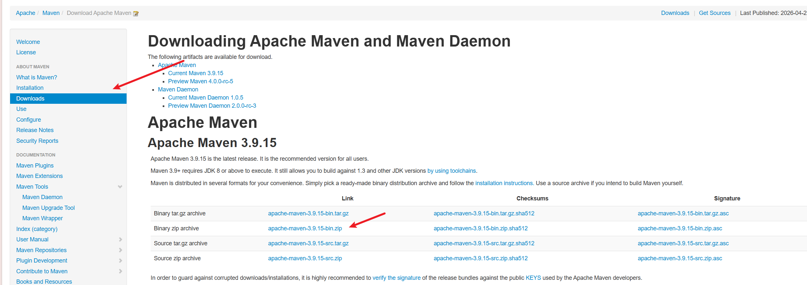
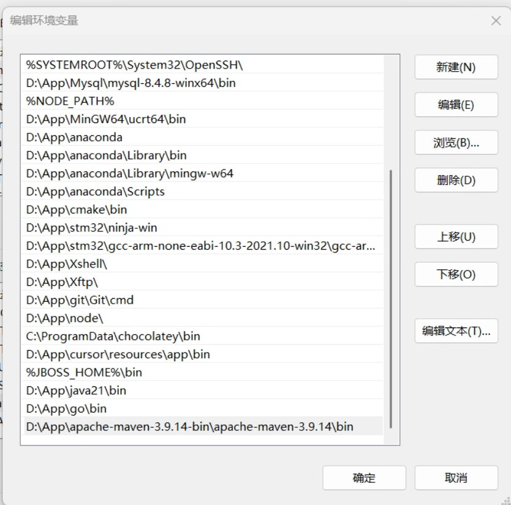
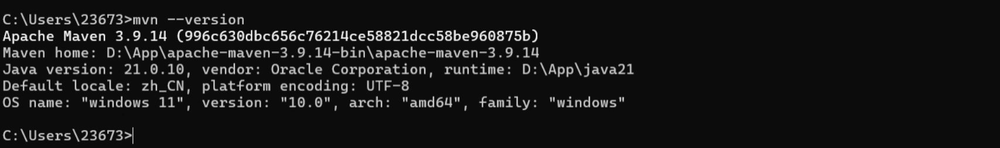
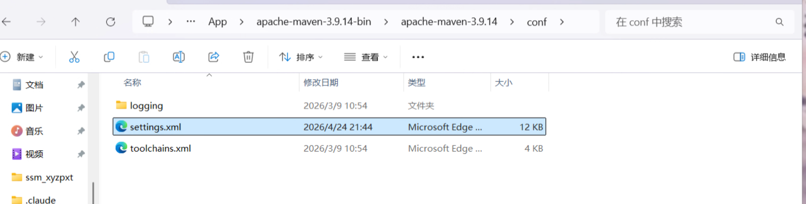
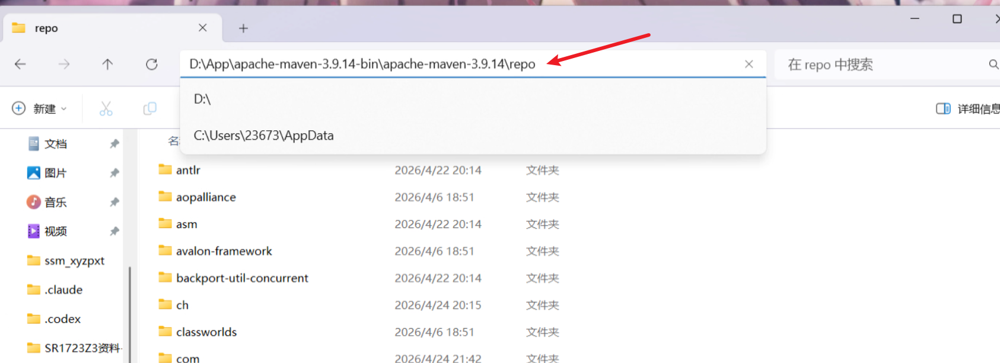
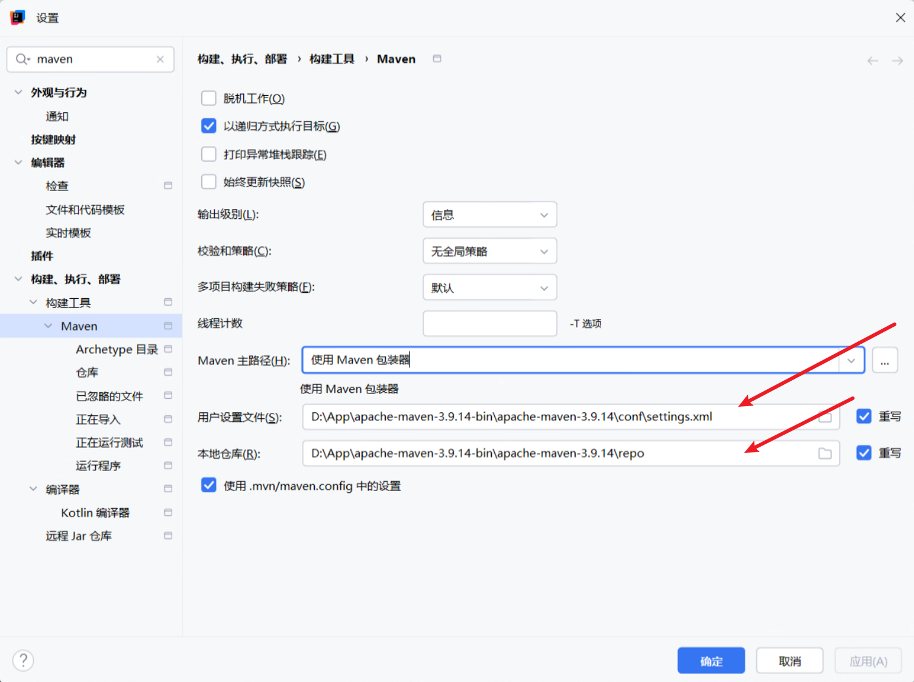

## Maven配置

#### 下载 Maven

进入Maven官网[Welcome to Apache Maven – Maven](https://maven.apache.org/)



进入文件夹，创建 repo 文件夹，用于存放 Maven 本地仓库依赖

#### 配置环境变量



检查是否配置成功



#### 配置settings.xml

打开settings.xml



复制刚才创建的repo目录



在 `settings.xml` 的第 `56` 行

```xml
<localRepository>D:\App\apache-maven-3.9.14-bin\apache-maven-3.9.14\repo</localRepository>
```

在 `settings.xml` 的第 `160` 行左右，配置阿里云镜像，加速依赖下载

```xml
<mirror>
  <id>aliyun-maven</id>
  <mirrorOf>central</mirrorOf>
  <url>https://maven.aliyun.com/repository/public</url>
  <blocked>false</blocked>
</mirror>
```

在 `settings.xml` 的 第 `192` 行，配置jdk，如果项目用到其他的jdk版本，也在这加就可以，我配置了jdk17和jdk21

```xml
<!-- JDK17 -->
<profile>
    <id>jdk-17</id>
    <activation>
        <activeByDefault>true</activeByDefault>
        <jdk>17</jdk>
    </activation>
    
	<properties>
    	<maven.compiler.source>17</maven.compiler.source>
    	<maven.compiler.target>17</maven.compiler.target>
    	<maven.compiler.compilerVersion>17</maven.compiler.compilerVersion>
	</properties>
</profile>
<!-- JDK21 -->
<profile>
    <id>jdk-21</id>
    <activation>
         <jdk>21</jdk>
    </activation>
    
    <properties>
         <maven.compiler.source>21</maven.compiler.source>
         <maven.compiler.target>21</maven.compiler.target>
         <maven.compiler.compilerVersion>21</maven.compiler.compilerVersion>
    </properties>
</profile>

```
按住 Win + R 运行 CMD ，输入 `mvn help:system`，如下所示表示配置成功：

#### IDEA配置Maven



## 创建SpringBoot项目

