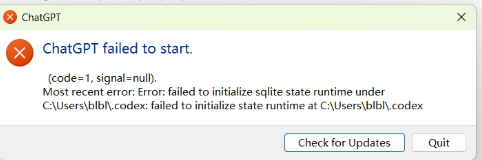

参考链接：https://github.com/openai/codex/issues/30105

> **多个 Codex 客户端（ChatGPT 桌面端 + VSCode IDE Codex 插件 + codex-cli）共用同一个 `~/.codex` 目录，会各自独立启动 app-server 进程** 其中一个进程锁住了 `logs_2.sqlite`（连带 wal/shm 文件）；**其他 Codex 实例启动时，初始化阶段要打开这个日志库，文件被锁 → 直接启动失败**
>
> ⚠️重点：**数据库本身没有损坏！`PRAGMA integrity_check`验证 DB 完好**，不是 sqlite 文件坏了，只是并发抢占锁。
>
> 这个`logs_2.sqlite`只是诊断日志库，但被放在**关键启动链路**上，一旦拿不到锁，整个 ChatGPT 桌面直接拒绝启动，弹窗提示`failed to initialize sqlite state runtime`。

### 触发条件

1. 同时跑多个 Codex 客户端：桌面 ChatGPT、VSCode Codex 插件、codex 命令行工具
2. 旧版本 Codex（你当前 Windows 客户端版本）**没有内置锁等待 / 优雅降级**，一旦`logs_2.sqlite`被占用，握手超时直接退出
3. 大体积`logs_2.sqlite`会加剧初始化慢、更容易超时锁失败（你的 Windows 环境也会出现）

### 出现问题截图



## ✅ 最简修复方案（不需要删除 / 重命名.codex，不会丢本地数据）

> 不需要备份重建！只找到占用`logs_2.sqlite`的进程 kill 掉即可

### Windows 操作

1. 关闭 VSCode（**重点！VSCode 里的 Codex 插件会后台跑 codex app-server，就是锁文件元凶**）
2. 任务管理器 → 详细信息，杀掉所有 `codex.exe`、`ChatGPT.exe` 进程
3. 再启动 ChatGPT 桌面端

> 如果你不想每次关 VSCode：**不要同时开多个 Codex 客户端共用同一个`.codex`目录** 可选方案：给不同客户端设置独立`CODEX_HOME`环境变量，分开存储，避免抢同一个 sqlite 库。

```bash
#用下面taskkill强制清理所有codex进程
taskkill /IM codex.exe /F
taskkill /IM ChatGPT.exe /F
```

## ✅ 临时规避（长期使用）

1. **不要同时打开 VSCode（Codex 插件）+ ChatGPT 桌面端**，这是最高频场景
2. 更新 ChatGPT 桌面客户端到新版：新版本增加了 SQLite WAL 配置 + 5s busy 超时，锁冲突概率下降，但**依然没有完全解决**，锁严重时还是会报错
3. 终极根治（官方还未合并这个 PR）：官方待合入补丁是把`logs_2.sqlite`改成**非致命、懒加载**，日志库打不开就降级使用内存临时日志，不再阻断程序启动。

## ✅ 补充说明

1. 报错弹窗文字很坑：只提示 “无法初始化 sqlite”，**不会告诉你是 logs_2.sqlite 被别的进程锁住**，这是日志打印层面代码缺陷，底层 sqlite 错误码没有透出到弹窗。
2. 不要上来就删除整个`.codex`文件夹，会丢失本地缓存，**数据库本身完好，仅仅是文件锁竞争**。

## 推荐使用习惯

- 只用**一个 Codex 客户端**访问`.codex`，要么 VSCode 插件，要么 ChatGPT 桌面，不同时开
- 如果需要同时使用：配置独立`CODEX_HOME`环境变量，隔离存储目录

