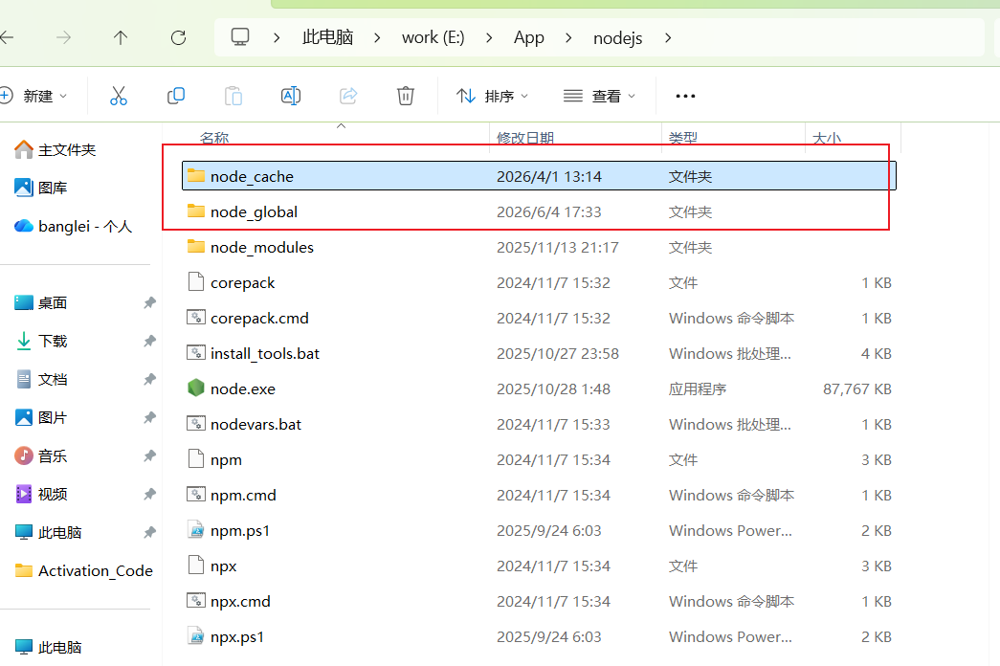
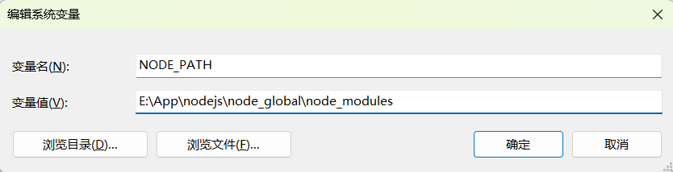
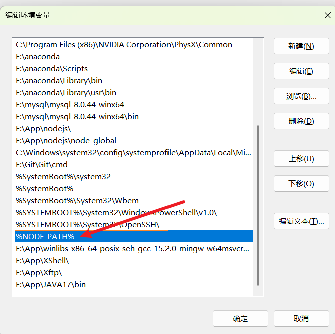

### Node.js安装流程

**下载安装包 ：**

- 访问 [Node.js 官方下载页面](https://nodejs.org/zh-cn/download)

**测试安装**

```bash
node -v   // 检查 Node.js 版本  
npm -v    // 检查 npm 版本
```

### 环境配置

**打开安装目录，新建两个文件夹 `node_global` 和 `node_cache`**



**配置 npm 路径**

- 以管理员身份打开CMD

- 替换为刚才创建的文件路径

```bash
npm config set prefix "E:\App\nodejs\node_global" 
```

```bash
npm config set cache "E:\App\nodejs\node_cache"
```

- 使用一下命令验证是否成功

```bash
npm config get prefix
npm config get cache
```

**配置环境变量**

- **变量名**：`NODE_PATH`
- **变量值**：`E:\App\nodejs\node_global\node_modules `（**复制刚刚创建的`node global`路径并在后面添加`\node modules`**）




- 编辑用户变量 `Path`：在 **用户变量** 区域，选择 `Path` 变量，点击 **编辑** 将默认的 `C:\Users\你的用户名\AppData\Roaming\npm` 路径修改为 `node_global` 文件夹的路径（如 `E:\App\nodejs\node_global`），然后点击确定。


- 更新系统变量 `Path`：在 **系统变量** 区域，选择 `Path`，点击 **编辑 **点击 **新建**，输入 `%NODE_PATH%`



- 测试 如果输出`E:\App\nodejs\node_global\node_modules `表示成功

```bash
echo %NODE_PATH% 
```

### 测试

输入下面命令进行安装 安装成功后，`node_global` 文件夹下会生成 `node_modules` 目录

```bash
npm install express -g
```

### 配置镜像

```bash
npm config set registry https://registry.npmmirror.com
```

