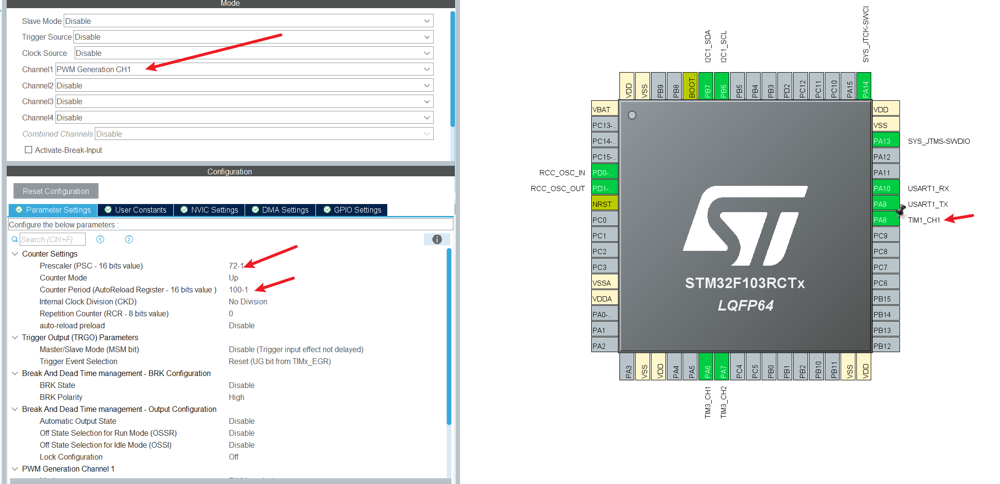
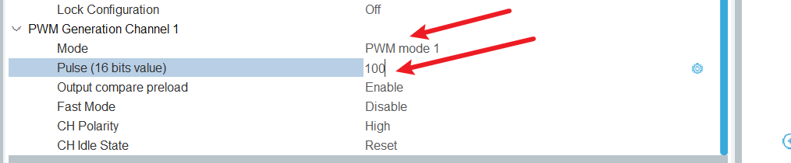
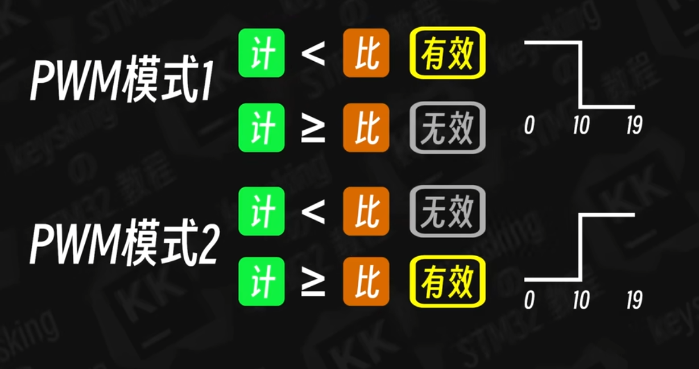
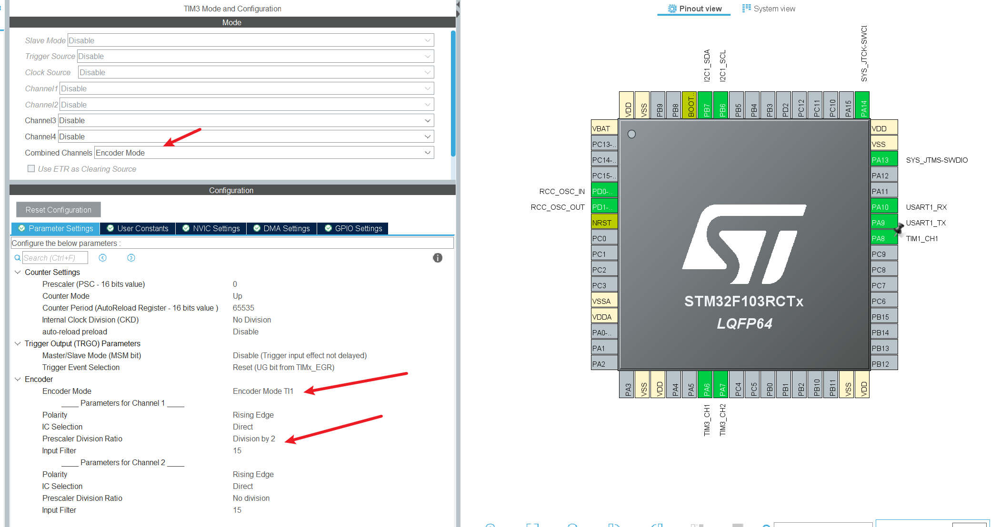
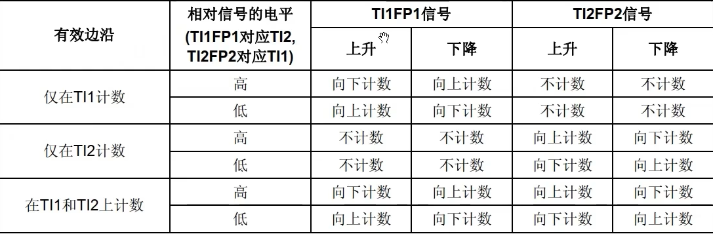

## PWM

### CubeMX配置

计算PWM脉冲周期公式：72MHz ➗ 72 = 1MHz  1M ➗ 100 = 10000Hz，即每秒计数10000次，每100为一个周期。

配置TIM1为PWM输出，用于控制呼吸灯，预分频器设置为72-1，自动重装载寄存器为100-1，计数到99后从0开始



PWM模式设置为PWM mode 1 ，比较寄存器的值初始值设置为100，通过控制比较计数器的值可以控制PWM占空比



PWM mode 1和 PWM mode 2理解如下图，



### HAL库中的PWM

```c
HAL_TIM_PWM_Start(&htim1, TIM_CHANNEL_1);			//启动 PWM 输出,通道1，tim1
HAL_TIM_PWM_Stop(&htim1, TIM_CHANNEL_1)					//停止 PWM 输出
__HAL_TIM_SET_COMPARE(&htim1, TIM_CHANNEL_1, new_value);			//控制占空比，通过设置比较计数器
```

## Encoder

### CubeMX配置


tim1配置同上PWM配置，tim3采用编码器模式1，选择TI1就是在通道A的边沿上计数如上图所示，**每次脉冲计数2次**如果没有分频的话。在极性设置类似有效电平机制，设置为下降沿则会将通道一的波形反转，并且计数器没有进行预分频处理，自动重装载寄存器为65535，



**模式 1（TI1）：A 相计数，B 相判向**

只在 TI1（A 相）的边沿计数；TI2（B 相）电平决定方向。

逻辑：

- A 相上升 / 下降沿 → 计数器 ±1
- 加还是减，**由此时 B 相的电平决定**

**模式 2（TI2）：B 相计数，A 相判向**

只在 TI2（B 相）的边沿计数；TI1（A 相）电平决定方向。

逻辑：

- B 相上升 / 下降沿 → 计数器 ±1
- 加还是减，**由此时 A 相的电平决定**



极性设置可以这样简单的理解，旋钮**左右方向反了**→ 随便把 CH1 或 CH2 设为 **Inverted 反相**


### 通过旋钮编码器控制呼吸灯案例

```c
//启动编码器
  HAL_TIM_Encoder_Start(&htim3, TIM_CHANNEL_ALL);
//启动pwm
  HAL_TIM_PWM_Start(&htim1, TIM_CHANNEL_1);

 while (1)
  { 
    OLED_NewFrame();
    counter = __HAL_TIM_GET_COUNTER(&htim3);
    sprintf(message, "counter:%d",counter);
    //顺时针扭动 增加 逆时针扭动 减少
    //当增加到 100 以后 则为100
    if (counter > 60000) {
      counter = 0;
      __HAL_TIM_SET_COUNTER(&htim3, counter);
    }
    //溢出65535
    else if (counter > 100) {
      counter = 100;
      __HAL_TIM_SET_COUNTER(&htim3, counter);
    }
    //将counter赋值给pwm
    __HAL_TIM_SET_COMPARE(&htim1, TIM_CHANNEL_1, counter);

    OLED_PrintString(16, 16, message, &font16x16, OLED_COLOR_NORMAL);
    OLED_ShowFrame();
    HAL_Delay(100);
    
    /* USER CODE END WHILE */

    /* USER CODE BEGIN 3 */
  }
```

