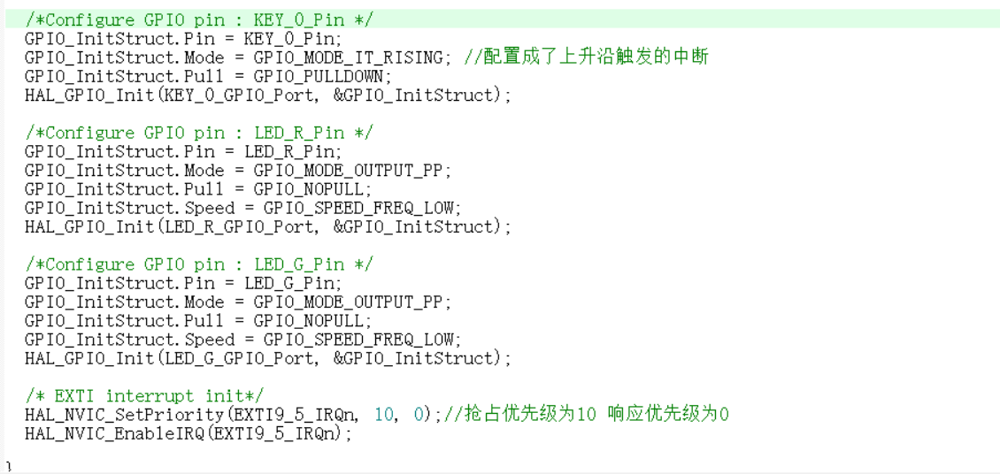
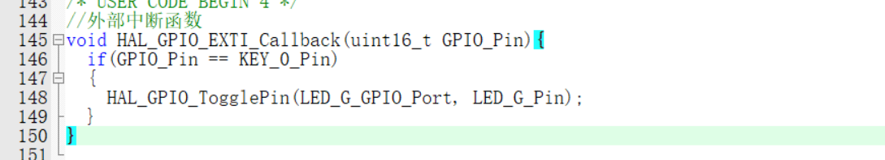
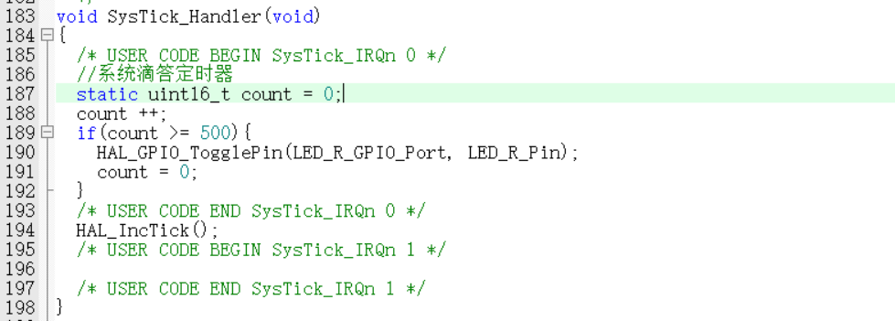

## STM32 中断系统

### 1嵌套向量中断控制器

中断可以由硬件或者软件触发。在ARM处理器中，把能够打断当前代码执行流程的事件分为异常（exception）和中断（interrupt）两类。二者的区别在于：中断是由内核外部产生的，一般由硬件触发，比如定时器中断和外部中断等。而异常通常是内核自身产生的，大多由软件触发，比如除法出错异常，预取指失败等。

在基于Cortex-M内核设计的ARM处理器中提供了一个专用的硬件模块：嵌套向量中断控制器 （nested vectored interrupt controller，NVIC）用来管理全部的异常和中断。通过对NVIC的编程，可以实现中断的使能、中断优先级的设置以及中断触发方式的选择等功能。

NVIC利用中断通道来管理各类中断，中断源通过中断通道向内核发出中断申请，这些中断通道已经固定分配给内核异常和片内外设。每一个中断通道对应一个中断服务程序，按照中断优先级的顺序组成了STM32微控制器 的中断向量表。不同型号的STM32微控制器支持的中断通道各不相同

### STM32中断优先级设置

中断源通过中断通道向内核发出中断申请，设置中断源的优先级实际上是设置中断通道的优先级。中断通道的优先级通过NVIC中的中断优先级寄存器NVIC_IP进行设置，该寄存器是8位，理论上可以配置256个中断优先级。STM32微控制器只使用了其中的高4位，并分成了两个优先级：抢占优先级（preempition priority）和子优先级（subpriority）。

抢占优先级：无关中断产生的先后，只比较优先级的高低。

子优先级：就是响应优先级，响应优先级主要给出了一种响应的优先队列。

具有高抢占式优先级的中断可以在具有低抢占式优先级的中断处理过程中被响应，即中断嵌套，或者说高抢占式优先级的中断可以嵌套低抢占式优先级的中断。通俗的理解就是，低抢占优先级的中断处理正在执行，来了一个高抢占式优先级的中断，即去执行高抢占式优先级的中断，执行完毕后，再去执行低抢占优先级的中断。

当两个中断源的抢占式优先级相同时，这两个中断将没有嵌套关系，当一个中断到来后，如果正在处理另一个中断，这个后到来的中断就要等到前一个中断处理完之后才能被处理。如果这两个中断同时到达，则中断控制器根据他们的响应优先级高低来决定先处理哪一个；如果他们的抢占式优先级和响应优先级都相等，则根据他们在中断表中的排位顺序决定先处理哪一个。

具体的分组情况如下：

第0组：所有4位用于指定子优先级。

第1组：最高1位用于指定抢占优先级，后面3位用于指定子优先级。

第2组：最高2位用于指定抢占优先级，后面2位用于指定子优先级。

第3组：最高3位用于指定抢占优先级，后面1位用于指定子优先级。

第4组：所有4位于指定抢占优先级。

不同分组情况下，抢占优先级和子优先级的等级划分如下表所示。

| 优先级分组                  | 抢占优先级       | 子优先级         |
| --------------------------- | ---------------- | ---------------- |
| 第0组：NVIC_PriorityGroup_0 | 无               | 4位/16级（0~15） |
| 第1组：NVIC_PriorityGroup_1 | 1位/2级（0~1）   | 3位18级（0~7）   |
| 第2组：NVIC_PriorityGroup_2 | 2位/4级（0~3）   | 2位/4级（0~3）   |
| 第3组：NVIC_PriorityGroup_3 | 3位/8级（0~7）   | 1位12级（0~1）   |
| 第4组：NVIC_PriorityGroup_4 | 4位/16级（0~15） | 无               |

在判断一个中断的优先级时，需要综合考虑这两个优先级。当多个中断同时提出中断申请时，抢占优先级高的中断会优先得到执行。如果抢占优先级相同，则比较子优先级；子优先级高的中断会优先得到执行。如果抢占优先级和子优先级都相同的话，就根据各中断在中断向量表中的位置来确定，中断向量表中靠前的中断优先得到执行。

在HAL库的初始化过程中，HAL库初始化函数HAL_Init()将优先级分组设置为第4组，即只有0~15共16级抢占式优先级，没有子优先级。编号越小的优先级越高：0号为最高，15号为最低。

## stm32中断代码案例

根据上方的优先级可以设置抢占优先级或者响应优先级，要注意key引脚的接法，这里我的引按键引脚是PC5

**情况 A：你按键是 一端接 PC5，一端接 GND 这是开发板最常见接法**

松开：PC5 = 1（上拉）

按下：PC5 = 0（到地）

这种接法必须：

上拉 + 下降沿 

**情况 B：如果按键是 一端接 PC5，一端接 3.3V**

松开：PC5 = 0（下拉）

按下：PC5 = 1（到电源）

这种需要：

下拉 + 上升沿



使用按键触发中断，当按下key0时电平翻转，点亮红灯

在main.c中重写HAL_GPIO_EXTI_Callback()函数



## 定时器与中断闪灯

SysTick_Handler()函数，`SysTick` 是 **Cortex-M 内核自带的定时器**（系统滴答定时器）。

- 默认配置：**每 1ms 溢出一次**

- 溢出后自动进入中断

- 进入中断就会执行：

  ```c
  void SysTick_Handler(void)
  {
      // 这里的代码每 1ms 自动跑一次！
  }
  ```


