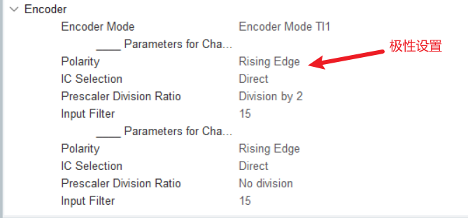
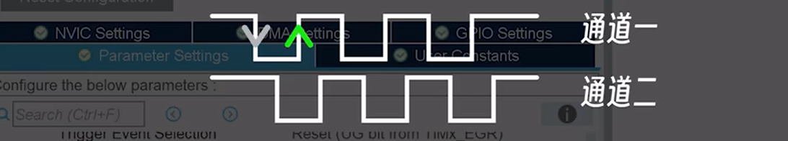

## 编码器原理


## Cubemx配置



选择TI1就是在通道A的边沿上计数，在极性设置类似有效电平机制，设置为下降沿则会将通道一的波形反转



选择TI2就是在通道B的边沿上计数，同理

### 代码案例

```c
  /* USER CODE BEGIN 2 */
  OLED_Init();
  //启动编码器
  HAL_TIM_Encoder_Start(&htim3, TIM_CHANNEL_ALL);
  //启动pwm
  HAL_TIM_PWM_Start(&htim1, TIM_CHANNEL_1);
  /* USER CODE END 2 */

  /* Infinite loop */
  /* USER CODE BEGIN WHILE */
  while (1)
  { 
    OLED_NewFrame();
    counter = __HAL_TIM_GET_COUNTER(&htim3);
    sprintf(message, "counter:%d",counter);
    //顺时针扭动 增加 逆时针扭动 减少
    //当增加到 100 以后 则为100
    if (counter > 60000) {
      counter = 0;
      __HAL_TIM_SET_COUNTER(&htim3, counter);
    }
    //溢出65535
    else if (counter > 100) {
      counter = 100;
      __HAL_TIM_SET_COUNTER(&htim3, counter);
    }
    //将counter赋值给pwm
    __HAL_TIM_SET_COMPARE(&htim1, TIM_CHANNEL_1, counter);

    OLED_PrintString(16, 16, message, &font16x16, OLED_COLOR_NORMAL);
    OLED_ShowFrame();
    HAL_Delay(100);
    
    /* USER CODE END WHILE */
W
    /* USER CODE BEGIN 3 */
  }
```

