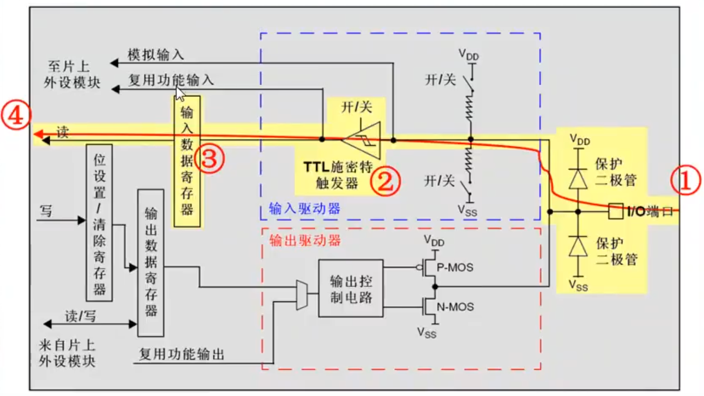

## GPIO的工作方式

### 4种输入模式

- 输入浮空



- 输入上拉


- 输入下拉


- 模拟输入

### 4种输出模式

- 开漏输出


- 开口复用功能


- 推挽输出


- 推完复用功能

## 串口打印数据

vscode重写

```c
int __io_putchar(int ch)
{
    HAL_UART_Transmit(&huart1, (uint8_t*)&ch, 1, HAL_MAX_DELAY);
    return ch;
}
```

Keil5重写

