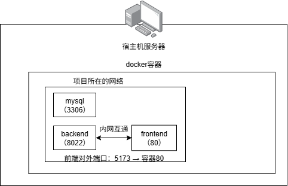
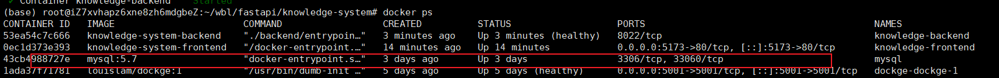

# 服务器部署

## Docker部署网络图



```markdown
1、Dockerfile是构建Docker镜像的基础,Docker通过读取Dockerfile中的指令，执行相应的操作（如添加文件、安装软件包、配置环境变量等），最终生成一个镜像 

2、Docker镜像是Docker容器的基础，docker build时会产生一个Docker镜像，当运行 Docker镜像时会真正开始提供服务 

3、Docker容器，依据镜像运行（docker run）容器提供服务
```

## Docker使用

### 数据库使用



```bash
# 进入数据库（mysql为docker创建的mysql名称，建议不要像我这样同名）
docker exec -it mysql mysql -uroot -proot123456
```

docker中的数据库可以看到与宿主机的mysql是隔离的，当前没有映射宿主机端口。

### Dockerfile文件使用

**Dockerfile的基本结构包括：**

| 命令                                       | 含义                                                         |
| :----------------------------------------- | :----------------------------------------------------------- |
| 基础镜像（FROM）                           | 指定构建新镜像所使用的基础镜像，在Dockerfile中第一条指令必须是FROM指令 |
| 设置工作目录（WORKDIR）                    | 指定后续指令的工作目录。                                     |
| 复制文件（COPY/ADD)                        | 将文件或目录复制到镜像中。ADD指令还可以自动解压压缩文件，但出于安全考虑，一般推荐使用COPY指令。 |
| 安装软件包（RUN）                          | 在镜像中运行命令，如安装软件包。RUN指令常用于安装依赖、编译程序等。 |
| 配置环境变量（ENV）                        | 设置环境变量，供镜像中运行的程序使用。                       |
| 暴露端口（EXPOSE）                         | 声明镜像中运行的应用将使用容器的哪个端口。不过，这并不会让端口自动在宿主机上监听，而是需要在运行容器时通过-p或-P参数来指定 |
| 容器启动时要运行的命令（CMD）              | Dockerfile中可以包含多个CMD指令，但只有最后一个生效。CMD指令可以被docker run命令行中的参数覆盖 |
| 配置容器启动时运行的可执行文件(ENTRYPOINT) | 与CMD不同，CMD的指令会被当作参数传递给ENTRYPOINT             |
| 声明容器运行时监听的端口(EXPOSE)           | 只是声明，并不会自动使端口对外提供服务                       |
| LABEL                                      | 为镜像添加元数据                                             |
| ENV                                        | 设置环境变量                                                 |
| VOLUME                                     | 创建一个可以从本地主机或其他容器挂载的挂载点，一般用来存放数据库和需要保持的数据等 |
| USER                                       | 指定运行容器时的用户名或UID                                  |
| HEALTHCHECK                                | 用于指定一个检查容器健康状态的命令                           |
| SHELL                                      | 允许覆盖用于命令的shell形式                                  |

```docker-compose.yml```文件用于自动化部署

```yaml
services:
  backend:
    build:
      context: .
      dockerfile: backend/Dockerfile
    container_name: knowledge-backend
    restart: unless-stopped
    env_file:
      - ./backend/.env
    environment:
      DB_HOST: mysql
      DB_PORT: 3306
      DB_USER: knowledge_user
      DB_PASSWORD: Knowledge@123
      DB_NAME: knowledge_system
    volumes:
      - ./backend/uploads:/app/backend/uploads
      - ./logs:/app/logs
    networks:
      - knowledge-net
    healthcheck:
      test: ["CMD", "python", "-c", "import urllib.request; urllib.request.urlopen('http://localhost:8022/health')"]
      interval: 30s
      timeout: 10s
      retries: 5
      start_period: 60s

  frontend:
    build:
      context: ./frontend
      dockerfile: Dockerfile
    container_name: knowledge-frontend
    restart: unless-stopped
    ports:
     # 服务器端口5173 映射 到docker容器内端口80，只暴露前端端口 后端8022不暴露
      - "5173:80"
    volumes:
      # 挂载本地构建好的 dist 目录（本地构建后直接生效，无需重新构建镜像）
      - ./frontend/dist:/usr/share/nginx/html:ro
    depends_on:
      - backend
    networks:
      - knowledge-net

networks:
  knowledge-net:
    driver: bridge
    external: false

```

```backend/dockfile```文件

```dockerfile
FROM python:3.11-slim

# 工作目录设为 /app，backend 代码放在 /app/backend/ 下，保持包路径 backend.main:app
# 如果还需要部署其他的项目【新项目独立工作目录】→ 叫 /app2 或 /newapp 都行，不和旧项目冲突
WORKDIR /app

# 安装系统依赖，一般都是安装依赖
RUN apt-get update && apt-get install -y --no-install-recommends \
    gcc \
    default-libmysqlclient-dev \
    pkg-config \
    && rm -rf /var/lib/apt/lists/*

# 复制依赖文件并安装（build context 是项目根目录）
COPY backend/requirements-docker.txt .
RUN pip install --no-cache-dir -r requirements-docker.txt

# 复制 aerich 配置和迁移文件（需要在 /app 根目录，aerich 从这里读取）
COPY pyproject.toml ./pyproject.toml
COPY backend/migrations ./migrations

# 复制 backend 代码到 /app/backend/
COPY backend ./backend

# 修复 entrypoint.sh 换行符（CRLF -> LF）并设置可执行权限
RUN sed -i 's/\r$//' ./backend/entrypoint.sh && \
    chmod +x ./backend/entrypoint.sh
# 新项目记得不要和旧项目的端口冲突
EXPOSE 8022

ENTRYPOINT ["./backend/entrypoint.sh"]
```

```frontend/dockerfile```文件

```dockerfile
# 生产阶段 - 直接使用本地构建好的 dist 目录
FROM nginx:alpine

# 只复制 nginx.conf，dist 目录通过 docker-compose volumes 挂载
COPY nginx.conf /etc/nginx/conf.d/default.conf

EXPOSE 80
```

- 构建项目

```bash
docker compose -d build
```

- 后续更新代码

```bash
git pull origin production
docker compose up -d --build backend # 构建镜像 启动容器
docker compose up -d frontend # 启动容器 docker-compose.yml中的frontend
docker compose up -d backend
```

- 查看日志

```bash
# 输入 -f 是指定文件 这条指定 docker-compose-app.yml
docker-compose -f docker-compose-app.yml logs -f 
#  查看backend容器的日志 1000条
docker logs --tail=1000 backend
```


